# PIE Elements - Architecture

## Overview

This is a modern implementation of the PIE (Platform Independent Elements) specification, built with TypeScript, ESM, and contemporary tooling. The project currently syncs React-based elements from the upstream [pie-elements](https://github.com/PieLabs/pie-elements) repository while providing modern ESM packaging, Vite builds, and improved developer experience. Future plans include native Svelte 5 implementations for smaller bundle sizes and better performance.

## Core Philosophy

### Why This New Project?

This is a **completely new project**, not a refactor of the original pie-elements. The legacy pie-elements project remains available for backwards compatibility, while this project provides a modern foundation for future development.

**Key reasons for a new project:**

- **Backwards compatibility**: Legacy consumers can continue using pie-elements without disruption
- **ESM enablement**: The PIE team's work on library updates (React, MUI) and migration from Slate to Tiptap now allows full ESM adoption
- **Modern tooling**: Clean slate enables use of Vite, Bun, and contemporary build tools
- **Unified player architecture**: ESM makes it possible to have a single player for all views (delivery, authoring, print)

### Legacy vs Modern: Key Architectural Differences


This project differs fundamentally from the legacy pie-elements in eight key ways:

1. **Framework Flexibility**: Legacy was React-only; this project is framework-agnostic via web components
2. **Module System**: CommonJS → ESM-first with browser-managed dependencies
3. **Build Tooling**: Bespoke tools (webpack, pie-shared-lib-builder) → Standard tools (Vite, Bun, Turbo)
4. **Bundle Strategy**: IIFE with all dependencies → ESM with on-demand loading
5. **Player Architecture**: Separate players per view → Unified player for all views
6. **Directory Organization**: Asymmetric structure → Symmetric peer folders
7. **CI/CD**: CircleCI → GitHub Actions
8. **Monorepo**: pie-lib was separate → now integrated in packages/lib-react/

## What Makes This Project Different

### 1. Framework Flexibility via Web Components

**Legacy approach**: React-only implementation. Every element, controller, and UI component was tightly coupled to React.

**Modern approach**: Framework-agnostic via web components and the PIE controller interface.

- **Controllers** are pure TypeScript business logic (completely framework-independent)
- **UI implementations** can use any framework (React, Svelte, Vue, Angular) as long as they produce web components
- **Element Player** loads elements via custom element registry, regardless of underlying framework
- **Coexistence**: React and Svelte elements work side-by-side in the same application

This flexibility allows choosing the right framework for each use case (e.g., Svelte for smaller bundles, React for ecosystem compatibility).

### 2. ESM-First Build System

**Legacy approach**: CommonJS modules with webpack and pie-shared-lib-builder creating IIFE bundles that include ALL dependencies.

**Modern approach**: ESM-only with modern build tools.

- Every package has `"type": "module"` in package.json
- Vite for fast builds with Hot Module Replacement (HMR)
- Bun as package manager (3-5x faster than npm)
- Turbo for monorepo orchestration with intelligent caching
- **External dependencies**: Not bundled, loaded by browser on-demand

**Benefits of ESM**:

- Better browser caching (shared dependencies across elements)
- Smaller initial bundle sizes (tree-shaking)
- Faster development (native ESM in browsers, instant HMR)
- Standards-based (no custom module system)

This was enabled by the PIE team's work on upstream library updates (React 18, MUI 7, Tiptap editor).

### 3. Unified Player Architecture (Enabled by ESM)

**Legacy approach**: Separate players for different views:

- One player for delivery (student/teacher interaction)
- Separate authoring interface
- Separate package for print views

**Modern approach**: Single unified player handles ALL views.

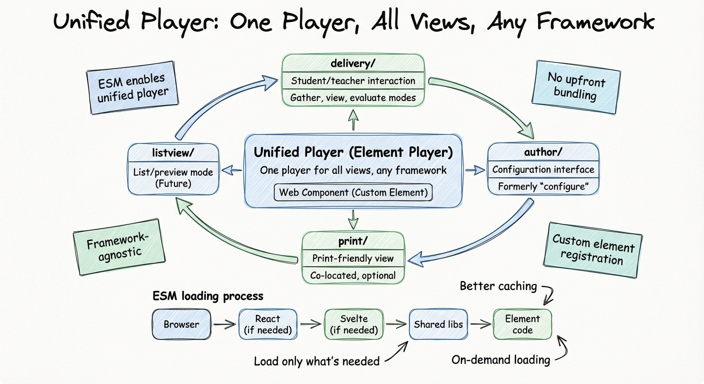

The element player can render:

- `delivery/` - Student and teacher interaction (gather, view, evaluate modes)
- `author/` - Configuration interface (formerly "configure")
- `print/` - Print-friendly rendering
- Future: `listview/` or other views as they're added

**Why ESM enables this**: Because dependencies are loaded on-demand by the browser, we don't need to create separate bundles for each view. The unified player loads only what it needs for the current view, making bundle size management unnecessary.

### 4. Symmetric Directory Organization

**Legacy approach**: Asymmetric structure

- Root of package = student view
- `config/` directory for authoring
- Print was a separate package

**Modern approach**: Symmetric peer folders at `src/` level

```
src/
├── delivery/     # Student/teacher interaction
├── author/       # Configuration interface
├── controller/   # Business logic
└── print/        # Print view (optional)
```

**Benefits**:

- Clear separation of concerns
- Each view is a peer (no implicit hierarchy)
- Easy to add new views (`listview/`, `mini/`, etc.) as additional peers
- Predictable package structure across all elements

### 5. Modern Standard Tooling

**Legacy approach**: Bespoke tooling

- Custom `pie-cli` for element management
- `pie-shared-lib-builder` for webpack configuration
- Custom build scripts and conventions

**Modern approach**: Standard, widely-adopted tools

- **Vite**: Industry-standard build tool with excellent ESM support
- **Bun**: Modern package manager and runtime
- **Turbo**: Proven monorepo orchestration
- **TypeScript**: First-class throughout
- **Biome**: Modern linting and formatting
- **Project CLI** (`tools/cli`): Built with oclif, has natural access to workspace code, used for upstream sync operations (not build tooling)

**Developer experience benefits**:

- Extensive documentation and community support for standard tools
- IDE integration works out of the box
- Fewer bespoke concepts to learn (build tooling is standard Vite)
- Can leverage ecosystem tooling (plugins, extensions)
- CLI uses oclif framework for robust command structure

### 6. Consolidated Demo System

**Legacy approach**: Per-element demos in `docs/demo/` folders, generated by pie CLI tooling (`pie install`, `pie clean` commands). Each element had its own `config.js`, `index.html`, and `generate.js`.

**Modern approach**: Single unified demo app (`apps/element-demo`) built with SvelteKit.

**Key differences**:
- **Legacy**: Tool-generated demo per element, separate HTML files, required pie CLI commands
- **Modern**: One app demos ALL elements, SvelteKit routing, auto-discovery of elements
- **Framework-agnostic**: The modern demo loads elements built with ANY framework (React, Svelte, future Vue/Angular)
- **Live editing**: Vite HMR with instant updates vs static generated HTML
- **Internal dev tool**: Not published, purely for development

The demo system works by dynamically loading elements via the unified player, regardless of their underlying framework implementation.

### 7. Monorepo with pie-lib Integration

**Legacy approach**:

- `pie-lib` was a separate repository
- Required coordinating releases across repos
- Version drift between pie-elements and pie-lib

**Modern approach**:

- `@pie-lib/*` packages pulled into monorepo under `packages/lib-react/`
- Single source of truth for all PIE code
- Workspace references (`"workspace:*"`) ensure consistency

### 8. Workspace-Wide Versioning

**Legacy approach**:

- Each element and library package had independent version numbers
- Elements could depend on any version of any `@pie-lib` package
- Example: `@pie-element/multiple-choice@12.0.0` might depend on `@pie-lib/math-rendering@4.1.0-next.4`
- `pie-lib` itself was a monorepo where each package had its own version
- Resulted in complex dependency graphs and version conflicts

**Modern approach**:

This project uses **workspace-wide versioning** where all packages share the same version number:

```json
{
  "name": "@pie-element/multiple-choice",
  "version": "1.5.0",
  "dependencies": {
    "@pie-lib/render-ui": "1.5.0",
    "@pie-lib/math-rendering": "1.5.0"
  }
}
```

**Why workspace-wide versioning?**

Modern monorepos overwhelmingly favor workspace-wide versioning for several compelling reasons:

1. **Simplicity** - One version number for the entire project
   - No mental overhead tracking which package is at which version
   - No complex dependency resolution across internal packages
   - Clear communication: "We're on PIE Elements v2.0"

2. **Dependency consistency** - Guarantees compatible package versions
   - In the legacy system, you could have: Element A → pie-lib-foo@1.0.0, Element B → pie-lib-foo@2.0.0
   - Different elements depending on incompatible versions of shared libraries
   - Workspace-wide versioning guarantees all packages are compatible

3. **Testing confidence** - What you test is what you ship
   - Legacy: Element tested with lib@4.0.0, shipped with lib@4.1.0 (untested combination)
   - Workspace-wide: All packages tested together as a unit
   - No untested version combinations in production

4. **Release process efficiency** - One decision, one release
   - No need to decide which packages need version bumps
   - No cascading releases (lib update → element update → player update)
   - Changesets handles the entire workspace as a unit

5. **Developer experience** - Easier mental model
   - `bun install` always gives you compatible versions
   - No need to manually synchronize package versions
   - Workspace protocol (`"workspace:*"`) ensures local linking during development

6. **Simplified patch releases** - Makes backporting fixes straightforward
   - Checkout the git hash/tag of any release (e.g., `v1.4.0`)
   - Fix the bug in any affected package(s) - elements, libs, wherever needed
   - All dependencies are at the exact versions they were tested with
   - Publish the patch release knowing everything is consistent
   - No need to track down which version of each lib package was used
   - No risk of pulling in untested dependency combinations

7. **Industry standard** - Most successful monorepos use this approach
   - React monorepo: All packages share version
   - Svelte monorepo: All packages share version
   - Turborepo examples: Workspace-wide versioning by default
   - Google's monorepo (Bazel): All code at HEAD, no versions

**Real-world pain from independent versioning:**

The legacy pie-elements/pie-lib approach created these problems:

```bash
# Developer scenario 1: Local development
$ cd pie-elements/packages/multiple-choice
$ npm install  # Gets @pie-lib/math-rendering@4.1.0

$ cd ../../pie-lib/packages/math-rendering
$ npm run build  # Makes changes to math-rendering

# Changes not reflected in multiple-choice!
# Must manually re-link or publish intermediate versions
```

```bash
# Developer scenario 2: Inconsistent dependency versions
# multiple-choice@12.0.0 depends on render-ui@5.0.0
# drag-in-the-blank@11.5.0 depends on render-ui@6.0.0
# Different elements using incompatible library versions
# Potential API mismatches and bundle bloat from duplicate dependencies
```

```bash
# Developer scenario 3: Release coordination nightmare
$ cd pie-lib
$ npm run publish  # Publish math-rendering@4.2.0

# Now must update ALL elements that use it:
$ cd pie-elements/packages/multiple-choice
# Edit package.json: "@pie-lib/math-rendering": "^4.2.0"
$ cd ../drag-in-the-blank
# Edit package.json: "@pie-lib/math-rendering": "^4.2.0"
# ... repeat for 50+ elements

# What if you miss one? Inconsistent versions in production!
```

```bash
# Developer scenario 4: Patch release hell
# Need to backport a fix to v11.0.0
$ git checkout v11.0.0

# Which versions of libraries were used?
$ cat packages/multiple-choice/package.json
# "@pie-lib/render-ui": "^5.0.0"  # Could be 5.0.0, 5.1.0, 5.2.0...
$ cat packages/drag-in-the-blank/package.json
# "@pie-lib/render-ui": "^5.1.0"  # Different version!

# Need to fix a bug in render-ui too - which version to fix?
# Have to check package-lock.json for each element
# Or worse, check what was actually published
# Risk of creating an untested combination
```

**How workspace-wide versioning solves this:**

```bash
# Developer scenario 1: Local development
$ cd pie-elements-ng
$ bun run build  # All packages built together
# All packages always reference each other via workspace protocol
# Changes to any package immediately available to all others
```

```bash
# Developer scenario 2: Guaranteed consistency
# All packages share version 1.5.0
# Impossible to have mismatched internal package versions
# All elements use compatible library versions
```

```bash
# Developer scenario 3: Simple releases
$ bun run changeset  # Describe changes
$ git push
# Changesets automatically:
# - Bumps ALL packages to 1.6.0
# - Updates all internal dependencies
# - Creates coordinated release
# Zero manual version updates needed
```

```bash
# Developer scenario 4: Straightforward patch releases
# Need to backport a fix to v1.4.0
$ git checkout v1.4.0
$ git checkout -b patch-1.4.1

# All dependencies are exactly as they were in v1.4.0
# No guessing, no hunting through package-lock.json
# Fix the bug in any affected packages
$ vim packages/elements-react/multiple-choice/src/delivery/index.tsx
$ vim packages/lib-react/render-ui/src/index.ts  # If needed

$ bun run changeset
# Select "patch"
$ git commit -am "fix: resolve XYZ issue"
$ git push

# All packages bumped to 1.4.1
# Everything is consistent and tested as a unit
# No risk of untested dependency combinations
```

**Publishing strategy:**

Not all packages in the monorepo are published to npm:

- **Element packages** (`@pie-element/*`) - Published for external consumption
- **Library packages** (`@pie-lib/*`) - **NOT published independently**
  - These are internal implementation details of the elements
  - Bundled into element packages during build
  - External consumers never import `@pie-lib` packages directly
  - Simplifies the public API surface

This differs from the legacy approach where `@pie-lib` packages were independently published and consumed. In pie-elements-ng, `@pie-lib` packages exist purely for internal code organization within the monorepo.

**Trade-offs:**

The main consideration is that element packages are released together, even if some haven't changed. However:

- **Storage**: Disk space and npm registry storage is cheap
- **Downloads**: Users only download what they import (ESM tree-shaking)
- **Clarity**: Outweighs the minor inefficiency of releasing unchanged packages
- **Automation**: Changesets makes this cost-free from a developer perspective
- **Reduced API surface**: Fewer published packages means simpler dependency management for consumers

**Migration from legacy versioning:**

This project inherits synced packages from the legacy independent versioning system but immediately converts them to workspace-wide versioning:

1. **Sync phase**: Pull element source from upstream (with independent versions)
2. **Normalization phase**: Rewrite all internal dependencies to `"workspace:*"`
3. **Build phase**: All packages built with coordinated versions
4. **Publish phase**: All packages released with same version number

This means once in pie-elements-ng, packages never experience the version coordination problems of the upstream project.

**Conclusion:**

Workspace-wide versioning is a deliberate architectural decision based on:

- Lessons learned from the upstream project's independent versioning challenges
- Industry best practices from successful monorepos
- Modern tooling (Changesets, Turborepo) designed around this pattern
- Practical development efficiency and release coordination needs

While independent versioning offers theoretical flexibility, the practical reality is that the coordination overhead, testing complexity, and potential for version conflicts make it unsuitable for tightly-coupled packages like PIE elements and libraries.

### 9. GitHub Actions CI/CD

**Legacy approach**: CircleCI for continuous integration and deployment.

**Modern approach**: GitHub Actions for all CI/CD workflows.

- **Integration**: Native GitHub integration (no external service)
- **Transparency**: Workflows visible in repository
- **Ecosystem**: Can use marketplace actions
- **Modern**: Industry-standard CI/CD platform

## Upstream Sync Strategy

This project maintains compatibility with the existing PIE ecosystem by syncing element implementations from upstream repositories.

### Source Repositories

- **[pie-elements](https://github.com/PieLabs/pie-elements)** → `packages/elements-react/`
  - 50+ production-tested React element implementations
  - Controllers (business logic)
  - UI components (delivery, authoring, print modes)

- **[pie-lib](https://github.com/PieLabs/pie-lib)** → `packages/lib-react/`
  - Shared UI libraries (config-ui, render-ui, etc.)
  - In some cases, we have full replacements for legacy pie-lib packages

### Why Sync?

1. **Leverage existing work** - Reuse 50+ production-tested elements
2. **Maintain compatibility** - Ensure consistency with existing PIE consumers
3. **Modernize existing code** - Transform to ESM, TypeScript, and modern tooling
4. **Stable baseline** - Synced React elements provide production-ready implementations

### How Syncing Works

The CLI tool (`tools/cli`) handles synchronization:

```bash
bun cli upstream:sync
```

**Process:**

1. **Analyze** - Scan upstream packages for ESM compatibility
2. **Copy** - Extract controller and UI code from upstream
3. **Transform** - Convert to modern format:
   - `.js` → `.ts` conversions
   - `.jsx` → `.tsx` conversions
   - Import rewrites (`lodash` → `lodash-es`, package path updates)
   - Inline constants and utilities
4. **Generate** - Create ESM-compatible configs:
   - `package.json` with proper exports
   - `vite.config.ts` for builds
   - `tsconfig.json` for TypeScript
5. **Commit** - Transformed source is committed to this repo

**What Gets Committed:**

- Transformed source files (`src/`) - ~1000 files
- Generated configs (`package.json`, `vite.config.ts`)
- Demo configs (`docs/demo/config.mjs`)

**What's Gitignored:**

- Build artifacts (`dist/`, `node_modules/`)
- Generated demo metadata (has timestamps, machine-specific paths)

See [UPSTREAM_SYNC_COMMIT_GUIDE.md](../UPSTREAM_SYNC_COMMIT_GUIDE.md) for details.

### Current State & Future

**Upstream sync is complete** - the React elements and libraries we have today are the stable baseline. Any future element implementations (Svelte, Angular, Vue, etc.) will be developed **natively in this repository**, not synced from upstream.

**Framework Flexibility:**

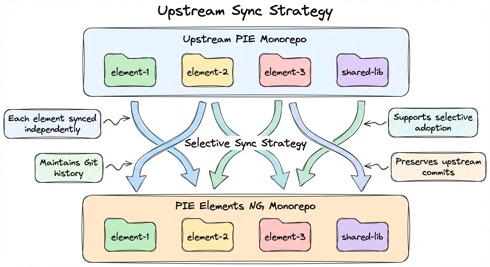

Multiple framework implementations can coexist. Consumers choose based on their needs.

## High-Level Architecture

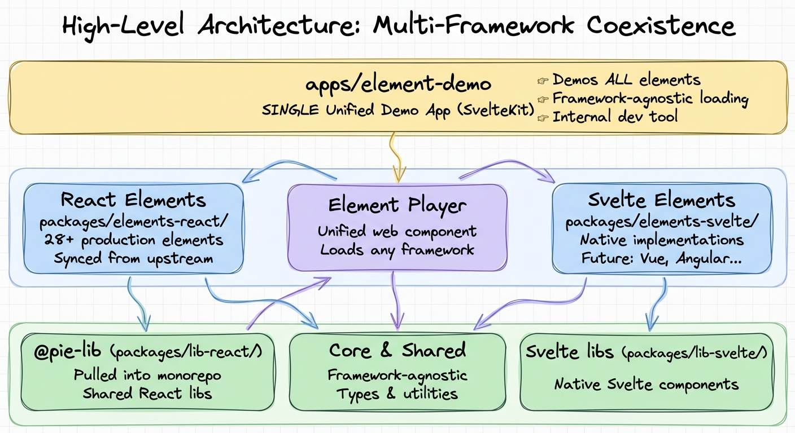

The architecture consists of three main layers:

**Application Layer**: A single unified demo app (`apps/element-demo`) built with SvelteKit that can demonstrate ALL elements regardless of their underlying framework. This is an internal development tool, not published to npm.

**Element Layer**: Elements can be implemented in any framework (currently React and Svelte), as long as they export web components and implement the PIE controller interface. The unified Element Player can load elements from any framework implementation.

**Foundation Layer**: Shared libraries (`@pie-lib/*` in `packages/lib-react/`), core PIE interfaces (`packages/core`), and framework-specific utilities coexist to support element development.

## Package Structure

### Repository Organization

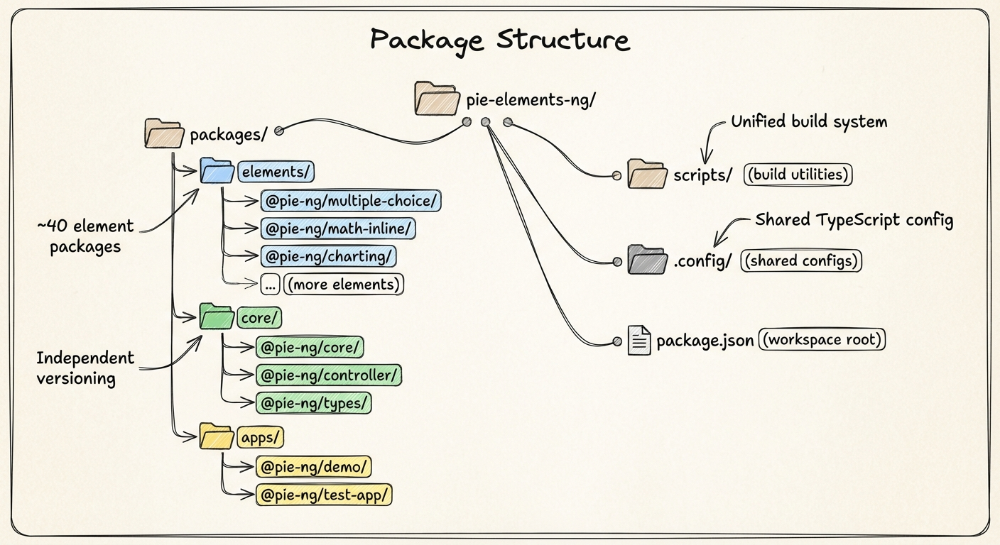

**Key organizational decisions**:

- **@pie-lib integration**: The `@pie-lib/*` packages (formerly a separate repository) are now in `packages/lib-react/` for better version management and coordination
- **Versioning**: Independent versioning using Changesets. Most synced packages are marked private; core packages like `@pie-element/core` are publishable
- **Workspaces**: Bun workspaces with `"workspace:*"` references ensure consistency across the monorepo

### Element Package Anatomy

Each element follows a consistent, symmetric structure where student UI, authoring UI, and business logic are peer folders at the same level:

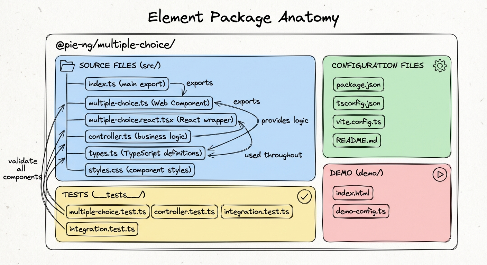

**Symmetric peer organization** (contrast with legacy):

**Legacy structure** (asymmetric):

- Root of package = student view
- `config/` directory for authoring
- Print was a separate package

**Modern structure** (symmetric):

- `src/delivery/` - student/teacher interaction
- `src/author/` - configuration interface
- `src/controller/` - business logic
- `src/print/` - print view (optional)

Future views like `mini/`, `listview/`, or others can be added as additional peer folders. This symmetric organization makes the package structure predictable and enables the unified player to load any view on demand.

### Separation of Concerns

#### 1. Controller (Business Logic)

**Location**: `src/controller/index.ts`

**Responsibility**: Framework-agnostic business logic

**Key Functions**:

- `model()` - Transform question model for rendering
- `outcome()` - Calculate score and feedback

```typescript
export async function model(
  question: MultipleChoiceModel,
  session: SessionData | null,
  env: PieEnvironment,
): Promise<ViewModel> {
  // Transform based on mode (gather/view/evaluate/authoring)
  // Apply role-based permissions (student/instructor)
  // Return view model for rendering
}

export async function outcome(
  question: MultipleChoiceModel,
  session: SessionData,
  env: PieEnvironment,
): Promise<PieOutcome> {
  // Calculate score
  // Generate feedback
  // Return outcome
}
```

**Why Separate**: Controllers are framework-agnostic business logic that can be shared or ported across implementations.

#### 2. Student Component (Interaction)

**Location**: `src/delivery/index.tsx` (React) or `src/delivery/{Element}.svelte` (Svelte)

**Responsibility**: Render question and handle user interaction

**Modes Handled**:

- `gather` - Interactive, user can answer
- `view` - Read-only, show question without interaction
- `evaluate` - Show score, feedback, correct answers

```svelte
<script lang="ts">
  let { model, session = $bindable(), env } = $props<Props>();

  const isDisabled = $derived(
    env.mode === 'view' || env.mode === 'evaluate'
  );
</script>

<div class="pie-multiple-choice">
  <Prompt prompt={model.prompt} />

  {#if env.mode === 'gather'}
    <!-- Interactive choices -->
  {:else if env.mode === 'evaluate'}
    <!-- Show correctness and feedback -->
  {:else}
    <!-- View mode: static display -->
  {/if}
</div>
```

#### 3. Authoring Component (Configuration)

**Location**: `src/authoring/index.ts` (React) or `src/authoring/{Element}Config.svelte` (Svelte)

**Responsibility**: Author/configure question settings

**Features**:

- Rich text editor for prompts
- Choice management (add/remove/edit)
- Configuration options (scoring, feedback, etc.)
- Preview of changes

```svelte
<script lang="ts">
  let { model = $bindable() } = $props<Props>();

  function updatePrompt(html: string) {
    model = { ...model, prompt: html };
  }
</script>

<RichTextEditor
  value={model.prompt}
  onChange={updatePrompt}
/>
```

## PIE Controller Interface

The PIE controller is the core contract that all elements implement:

```typescript
export interface PieController {
  /**
   * Transform question model for rendering
   * @param question - Element configuration
   * @param session - User's current answer/state
   * @param env - Rendering environment (mode, role)
   * @returns View model for component rendering
   */
  model(
    question: PieModel,
    session: SessionData | null,
    env: PieEnvironment,
  ): Promise<ViewModel>;

  /**
   * Calculate outcome based on session
   * @param question - Element configuration
   * @param session - User's answer
   * @param env - Evaluation environment
   * @returns Score, feedback, and correctness
   */
  outcome(
    question: PieModel,
    session: SessionData,
    env: PieEnvironment,
  ): Promise<PieOutcome>;
}
```

### PieEnvironment

```typescript
export interface PieEnvironment {
  mode: "gather" | "view" | "evaluate" | "authoring" | "print";
  role: "student" | "instructor";
}
```

**Modes**:

- `gather` - Student answering question
- `view` - Read-only display (no interaction)
- `evaluate` - Show score, feedback, correct answers
- `authoring` - Authoring/configuration interface
- `print` - Static rendering for paper/PDF

**Roles**:

- `student` - Learner interacting with assessment
- `instructor` - Teacher/author viewing or configuring

### PieModel

```typescript
export interface PieModel {
  id: string;
  element: string;
  prompt?: string;
  // Element-specific properties
}
```

### PieOutcome

```typescript
export interface PieOutcome {
  score: number; // 0.0 to 1.0
  correct?: boolean; // Binary correct/incorrect
  feedback?: string; // Feedback message
  rationale?: string; // Explanation
  // Element-specific outcome data
}
```

## State Management

### Session State

**Session** represents the user's current answer/state for an element.

```typescript
interface Session {
  value?: unknown; // Element-specific answer data
  // Additional session metadata
}
```

**Flow**:

1. User interacts with element
2. Component updates `session` via `$bindable()`
3. Parent receives `onSessionChange` event
4. Session persisted (by consumer application)
5. On page reload, session passed back to element

### Model State

**Model** represents the question configuration (authored content).

**Immutable**: Models should not change during student interaction. Changes only happen in authoring mode.

### Reactivity with Svelte 5

Svelte 5 runes provide fine-grained reactivity:

```svelte
<script lang="ts">
  // Props (from parent)
  let { model, session = $bindable(), env } = $props<Props>();

  // Local state
  let localState = $state(0);

  // Derived/computed values
  const isDisabled = $derived(env.mode !== 'gather');

  // Side effects
  $effect(() => {
    console.log('Session changed:', session);
  });
</script>
```

## Data Flow

### Gather Mode (Student Interaction)

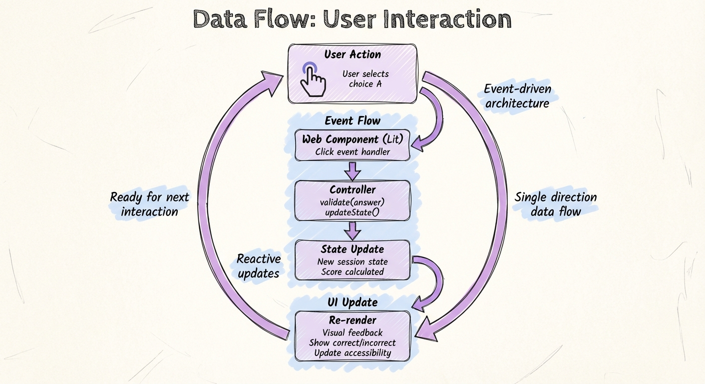

### Evaluate Mode (Scoring)

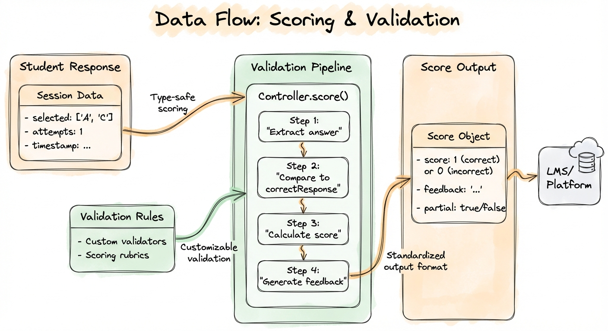

### Authoring Mode (Configuration)

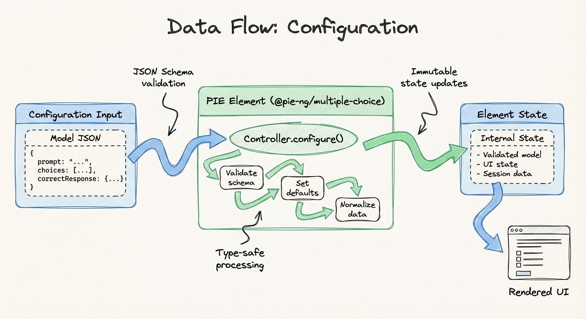

## Dependency Structure

### Dependency Graph

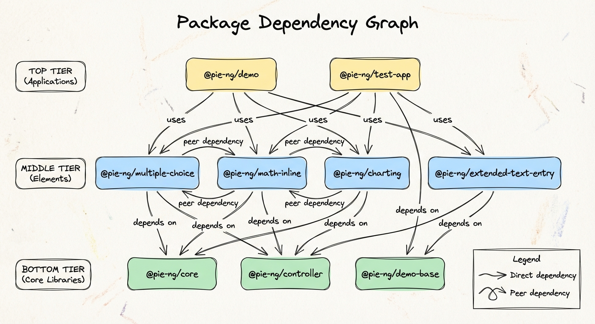

### Package Dependencies

**Core**: No dependencies (pure interfaces)

**Shared**: Depends on core

**Lib-UI**: Depends on core, may use shared utilities

**Elements**: Depend on core, lib-ui, shared

**Apps**: Depend on elements

### Avoiding Circular Dependencies

- Core defines interfaces only
- Shared utilities are stateless
- Elements don't depend on each other
- Apps are top-level consumers

## Technology Choices

### Why Svelte 5?

**Benefits**:

- Native Web Components support
- Smaller bundle size (~3KB overhead vs 40KB+ for React)
- True reactivity without virtual DOM
- Runes API provides clear, predictable state management
- Excellent TypeScript support

**Trade-offs**:

- Smaller ecosystem than React
- Less community resources
- Learning curve for React developers

### Why TypeScript?

**Benefits**:

- Type safety catches errors early
- Better IDE support (autocomplete, refactoring)
- Self-documenting code
- Easier refactoring
- Improved maintainability

### Why Bun?

**Benefits**:

- Fast package installation (3-5x faster than npm)
- Built-in test runner
- Native TypeScript support
- All-in-one tool (package manager + bundler + runner)

**Trade-offs**:

- Newer, less proven than npm/yarn
- Some compatibility issues (using Vitest instead of Bun test for now)

### Why Vite?

**Benefits**:

- Extremely fast HMR (Hot Module Replacement)
- Native ESM support
- Excellent Svelte integration
- Modern, optimized builds

### Why Turbo?

**Benefits**:

- Fast monorepo builds (caching, parallelization)
- Task orchestration
- Smart dependency graph execution

## Testing Strategy

### Test Pyramid

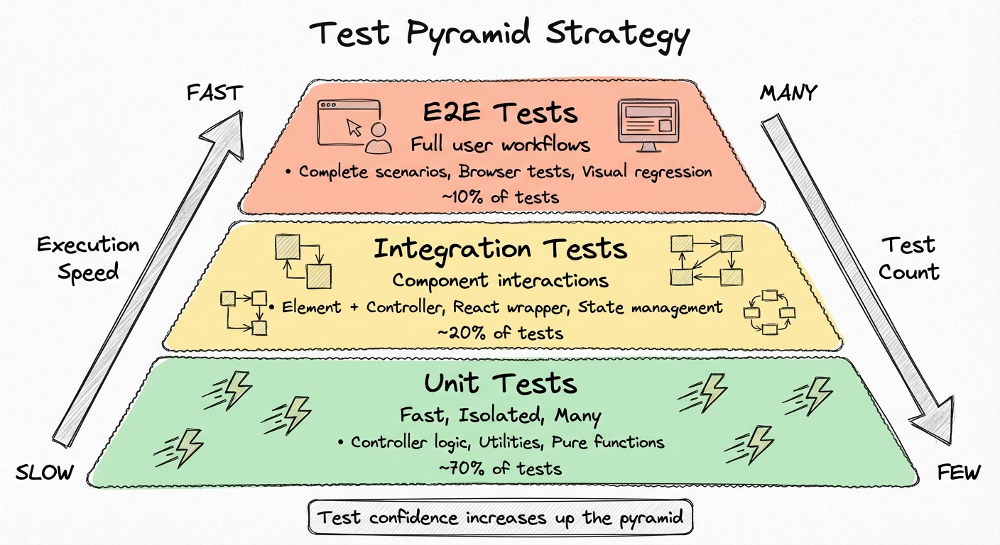

### Test Categories

1. **Unit Tests** - Controller logic, utilities
2. **Component Tests** - Svelte components with Testing Library
3. **Integration Tests** - Multi-package workflows
4. **E2E Tests** - Full browser automation with Playwright
5. **Accessibility Tests** - axe-core scans
6. **Evaluation Tests** - YAML-driven comprehensive scenarios

See [testing.md](./testing.md) for details.

## Demo Application

### Element Demo (SvelteKit)

**IMPORTANT**: This is an **internal development tool**, NOT published to npm. It exists solely for testing and demonstrating elements during development.

**Location**: `apps/element-demo/`

**Purpose**: A single unified demo application that can demonstrate ALL PIE elements, regardless of which framework they're built with (React, Svelte, or future frameworks).

The demo uses the unified Element Player to dynamically load elements via custom element registration, making it framework-agnostic.

**Features:**

- Interactive element testing (gather, view, evaluate modes)
- Live model/session editing
- Controller testing
- Math rendering preview
- Accessibility testing

**Architecture:**

```
apps/element-demo/
├── src/
│   ├── routes/
│   │   └── [element]/        # Dynamic route for any element
│   │       ├── +page.svelte   # Main player page
│   │       └── +layout.ts     # Data loader
│   └── lib/
│       ├── element-player/    # Player implementation
│       ├── elements/
│       │   └── registry.ts    # GENERATED: Element metadata
│       ├── data/
│       │   └── sample-configs/ # GENERATED: Sample configs
│       └── element-imports.ts  # GENERATED: Import map
```

**Generated Files (gitignored):**

These files are automatically generated and should NOT be committed:

1. **`registry.ts`** - Element metadata (has timestamps)
   - Generated by scanning `packages/elements-react/`
   - Created during `upstream:sync` and `predev` script

2. **`element-imports.ts`** - Import map
   - Maps element names to absolute `/@fs/` paths for Vite
   - Generated by `predev` script before `bun run dev`

3. **`sample-configs/`** - Demo data
   - Copied from `packages/elements-react/*/docs/demo/`
   - Redundant (source is already in element packages)

**Running the Demo:**

```bash
cd apps/element-demo
bun run dev              # Runs predev script, then starts dev server
```

The `predev` script automatically regenerates all required files before starting the server.

**URL Format:**

```
http://localhost:5173/[element-name]

Examples:
http://localhost:5173/multiple-choice
http://localhost:5173/hotspot
```

## Build Process

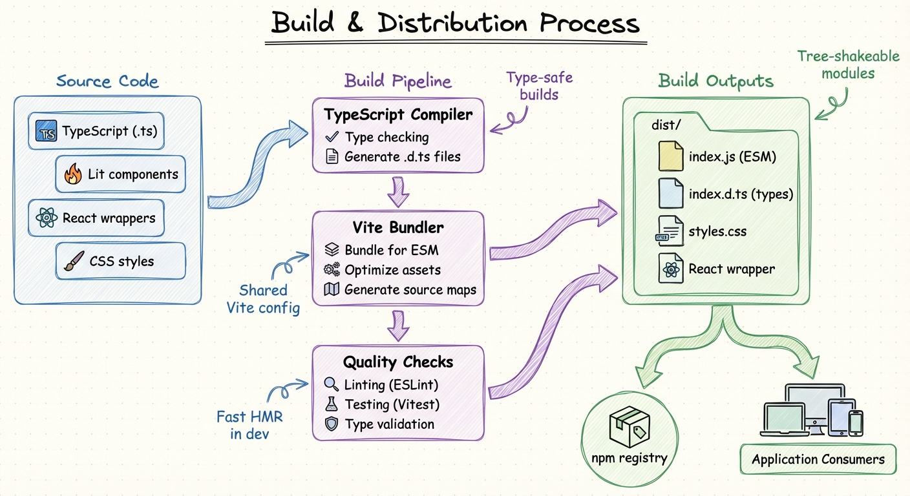

### ESM-First Approach

**Contrast with legacy**:

**Legacy (webpack + IIFE)**:

- Bundled ALL dependencies into single IIFE file
- Large bundle sizes (~1-2MB per element)
- No tree-shaking across elements
- Required custom bundle service (pie-shared-lib-builder)

**Modern (ESM + Vite)**:

- External dependencies loaded by browser
- Small element bundles (~15-40KB per element)
- Browser caches shared dependencies
- Tree-shaking works naturally
- Standards-based module loading

This ESM-first approach is what enables the unified player architecture - the browser manages dependency loading, so we don't need separate bundles for each view.

### Development Build

```bash
bun run dev
```

- Watches for file changes
- Rebuilds affected packages
- Hot module replacement in the demos app
- Fast feedback loop

### Production Build

```bash
bun run build
```

1. Turbo orchestrates build order (respects dependencies)
2. Each package builds with Vite
3. TypeScript compilation
4. Bundle optimization (tree-shaking, minification)
5. Output to `dist/` directories

### Build Output

**ESM** (ES Modules) format for modern bundlers:

```javascript
// dist/index.js
export { default as MultipleChoice } from "./MultipleChoice.js";
export { model, outcome } from "./controller.js";
```

**IIFE** (Immediately Invoked Function Expression) format for CDN deployment:

```javascript
// dist/index.iife.js
(function () {
  // Self-contained bundle with all dependencies (React, etc.)
  // Auto-registers custom element: <multiple-choice-pie>
  // Size: ~1.2MB / 400KB gzipped
})();
```

**Key difference from original pie-elements**: The original `@pie-element/*` packages do NOT include IIFE builds. They only publish CommonJS (`lib/index.js`) and ESM source (`src/index.js`). This project adds IIFE builds to enable zero-config CDN deployment via `<script>` tags.

**Types**: TypeScript definitions generated:

```typescript
// dist/index.d.ts
export declare const MultipleChoice: Component<Props>;
```

## Accessibility

### WCAG 2.2 Level AA Compliance

All elements must meet WCAG 2.2 Level AA standards:

- **Perceivable**: Text alternatives, color contrast, adaptable layouts
- **Operable**: Keyboard navigation, sufficient time, seizure prevention
- **Understandable**: Readable text, predictable behavior, input assistance
- **Robust**: Compatible with assistive technologies

### Testing

Every element must pass:

1. **Automated scans** with axe-core
2. **Keyboard navigation** testing
3. **Screen reader** testing (manual)
4. **Touch target** size validation (44x44px minimum)
5. **Color contrast** checks

See [WCAG 2.2 Quick Reference](https://www.w3.org/WAI/WCAG22/quickref/)

## Performance

### Bundle Size Targets

- **Element (Svelte)**: < 15KB gzipped
- **Element (React)**: < 40KB gzipped (includes React runtime)
- **Shared libraries**: < 30KB gzipped each
- **Total for typical assessment**: < 200KB gzipped

### Optimization Techniques

1. **Tree-shaking**: Only include used code
2. **Code splitting**: Load elements on-demand
3. **Dynamic imports**: Lazy-load heavy dependencies (MathLive, etc.)
4. **Svelte compilation**: No runtime overhead
5. **Shared dependencies**: Deduplicate common libraries

### Performance Monitoring

- First Contentful Paint (FCP) < 1s
- Time to Interactive (TTI) < 3s
- Lighthouse score > 90

## Security

### XSS Prevention

- **DOMPurify** sanitizes all HTML content
- Never use `{@html}` without sanitization
- Validate user input on both client and server

### Content Security Policy

Elements should work with strict CSP:

```
default-src 'self';
script-src 'self';
style-src 'self' 'unsafe-inline';
```

Note: `'unsafe-inline'` for styles is required for Svelte scoped styles.

## Deployment

### NPM Publishing

Packages are published to npm via GitHub Actions:

1. Developer creates changeset: `bun run changeset`
2. PR merged to main
3. GitHub Action creates "Version Packages" PR
4. Maintainer merges Version PR
5. Packages automatically published to npm

See [PUBLISHING.md](./PUBLISHING.md) for details.

### Versioning

This project uses **workspace-wide versioning** where all packages share the same version number. This is a deliberate architectural decision that differs from the upstream pie-elements/pie-lib projects. See [section 8 above](#8-workspace-wide-versioning) for a detailed explanation of why this approach was chosen and the problems it solves.

**Semantic Versioning (SemVer)**:

All packages follow semantic versioning as a coordinated unit:

- **Major** (1.0.0): Breaking changes in any package
- **Minor** (0.1.0): New features in any package, backward compatible
- **Patch** (0.0.1): Bug fixes in any package

**How versioning works:**

1. Developer makes changes to any package(s)
2. Run `bun run changeset` to describe the change
3. Changesets automatically determines the appropriate version bump
4. All element packages are released together with the same new version
5. Internal dependencies automatically updated to the new version

**Example release:**

```bash
# Before: All element packages at 1.4.0
$ bun run changeset
# Select "minor" for a new feature in multiple-choice
# PR merged

# After: All element packages bumped to 1.5.0
@pie-element/multiple-choice: 1.5.0     # Published to npm
@pie-element/drag-in-the-blank: 1.5.0   # Published to npm (even though unchanged)

# Internal packages are versioned but NOT published:
@pie-lib/render-ui: 1.5.0               # Internal only (bundled into elements)
@pie-lib/math-rendering: 1.5.0          # Internal only (bundled into elements)
```

This ensures all packages are always compatible and tested together. External consumers only interact with `@pie-element/*` packages, which bundle all necessary dependencies.

### CDN Distribution

Packages can be loaded from CDN:

```html
<script type="module">
  import { MultipleChoice } from "https://esm.sh/@pie-element/multiple-choice";
</script>
```

## Extension Points

### Adding New Elements

See [CONTRIBUTING.md](./CONTRIBUTING.md) for step-by-step guide.

Key requirements:

1. Implement PIE controller interface
2. Create student component
3. Create authoring component
4. Add comprehensive tests
5. Document usage

### Custom Themes

Elements use CSS variables for theming:

```css
:root {
  --color-primary: #3b82f6;
  --color-base-100: #ffffff;
  --color-base-content: #1f2937;
}
```

Consumers can override variables to match their brand.

### Plugin System (Future)

Planned extension points:

- Custom validators
- Custom feedback generators
- Custom rendering plugins
- Third-party integrations

## Best Practices

### Session State: One-Way Data Flow

**Rule:** Session flows from element → player only, never back.

```svelte
<!-- ❌ Wrong: bidirectional creates infinite loops -->
let { session = $bindable({}) } = $props();
$effect(() => { element.session = session; });  // Triggers loop

<!-- ✅ Correct: read-only, observe via events -->
let { session = {} } = $props();
let internalSession = $state(session);

function handleSessionChange(event) {
  internalSession = event.detail.session;
  dispatch('session-changed', event.detail);
}
```

**Why:** Elements own their session state (user responses). Players observe changes via events. Pushing session back to elements creates loops: update → effect → element fires event → update → repeat.

### Use $bindable Sparingly

Use `$bindable` only for true bidirectional flow:

- ✅ UI controls: `mode`, `playerRole`, `splitRatio`
- ✅ Settings: `partialScoring`, `addCorrectResponse`
- ❌ Session state (element owns it)
- ❌ Derived values (use `$derived` instead)

## Future Enhancements

### Planned Features

1. **Multi-Framework Support**
   - Add native implementations in additional frameworks as needed
   - Svelte 5 elements for smaller bundles (~15KB vs ~40KB)
   - Angular elements for Angular-native consumers
   - Vue elements for Vue-native consumers
   - All developed directly in this repository

2. **Web Components as Distribution Format**
   - Framework-agnostic custom elements
   - Standard browser APIs
   - Universal compatibility across frameworks
   - Can wrap any framework implementation

3. **Plugin Architecture**
   - Extensible validation
   - Custom scoring algorithms
   - Custom rendering plugins
   - Third-party integrations

4. **Edge Runtime Support**
   - Deno, Cloudflare Workers compatibility
   - Serverless controller execution
   - Distributed scoring

## References

- [PIE Framework](https://github.com/pie-framework)
- [Svelte 5 Documentation](https://svelte.dev/)
- [TypeScript Handbook](https://www.typescriptlang.org/docs/)
- [WCAG 2.2 Guidelines](https://www.w3.org/WAI/WCAG22/quickref/)
- [Vite Documentation](https://vitejs.dev/)

---

**Document Version**: 1.0
**Last Updated**: 2025-01-07
**Status**: Living Document
