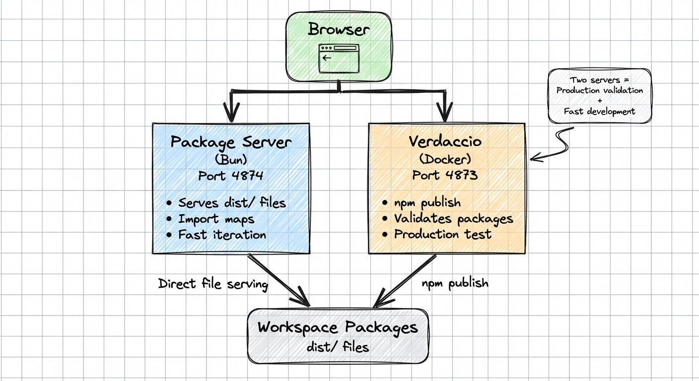
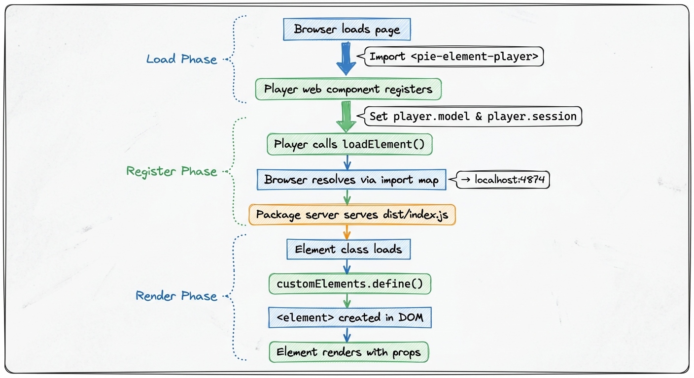
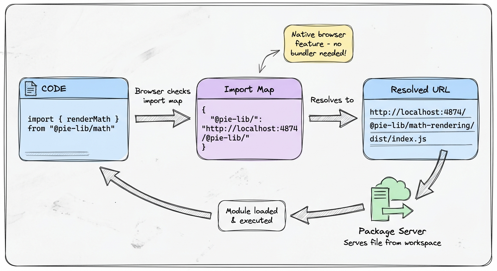

# PIE Element Demo System

## Overview

This document describes the demo system for PIE elements (both React and Svelte), using a two-tier architecture that provides both **production validation** and **fast development iteration**.

## Quick Start

**Run a demo from the repo root** (recommended):

```bash
# React element demo (fast startup, no validation)
bun run dev:demo:react multiple-choice

# Svelte element demo (fast startup, no validation)
bun run dev:demo:svelte slider

# With package validation (slower, validates npm-readiness)
bun run dev:demo:react multiple-choice --validate
```

This automatically:

- ✅ Builds required packages
- ✅ Starts both package server and Vite dev server
- ✅ Opens your browser to the demo
- 🔍 Optional: Validates packages can be published (--validate flag)

**When to use `--validate`:**

- Before committing changes to package.json or exports
- Before publishing to npm
- When CI/E2E tests need validation

**Normal development:**

- Default (no --validate) is fast and sufficient for day-to-day work
- Just rebuilds and serves from dist/ folders

**Alternative - Run from element directory:**

```bash
cd packages/elements-react/multiple-choice
bun run demo
```

## Architecture

### Two-Tier Design



The demo system uses two complementary servers working together:

| Server | Port | Purpose | Technology |
|--------|------|---------|------------|
| **Package Server** | 4874 | Serves built `dist/` files directly to browser via import maps | Bun script |
| **Verdaccio** | 4873 | Validates packages can be published to npm registry | Docker container |

**Why two servers?**

This architecture gives us the best of both worlds:

1. **Production Validation** (Verdaccio) - *Used at startup*
   - Validates packages once when starting the demo
   - Ensures packages are production-ready before real npm publish
   - Validates `package.json` configuration and exports
   - Catches packaging issues early (missing files, wrong paths)
   - Runs in background after initial validation

2. **Fast Development** (Package Server) - *Used continuously*
   - Serves files directly from workspace `dist/` folders to browser
   - No need to republish after every code change
   - Just rebuild and refresh browser for instant updates
   - CDN-like URLs for browser import maps
   - This is what the browser actually loads from during development

**Development Workflow:**

When you run `bun run dev:demo:react multiple-choice`, here's what happens:

1. 🔍 **Startup validation** (one-time)
   - Verdaccio Docker container starts (if not running)
   - Packages are published to Verdaccio
   - This validates they're production-ready

2. 🚀 **Continuous serving** (during development)
   - Package Server starts on port 4874
   - Vite dev server starts on port 5174
   - Browser loads from Package Server (not Verdaccio!)

3. 🔄 **Making changes**
   - Edit code in your element
   - Rebuild: `bun run build` (in element directory)
   - Refresh browser - changes appear instantly
   - No need to republish to Verdaccio!

**Key point:** Browser gets files from Package Server (port 4874), not Verdaccio. Verdaccio just validates once at startup that packages are correct.

### Key Components

#### 1. Element Player (`packages/shared/element-player/`)

A reusable Svelte 5 web component that provides a complete demo environment:

```html
<pie-element-player
  element-name="multiple-choice"
  id="player"
></pie-element-player>
```

**Features:**
- Custom element with `shadow: none` for flexible styling
- Props: `elementName`, `model`, `session`
- Dynamically loads and registers PIE elements as custom HTML elements
- Integrates controller for scoring in evaluate mode
- Built-in mode selector (gather/view/evaluate)
- Session and scoring panels
- **Multi-tab interface** for comprehensive authoring and testing

##### Multi-Tab Interface

The element player provides three integrated views for a complete authoring and testing experience:

**1. 📊 Delivery Tab** (Student/Teacher View)

- The learner-facing interface with three modes:
  - **Gather** - Answer/input mode (student fills in answers)
  - **View** - Review mode (show answers without scoring)
  - **Evaluate** - Scoring mode (show correct answers and score)
- Role switching between Student and Instructor perspectives
- Real-time session tracking
- Default tab when opening the demo

**2. ✏️ Author Tab** (Authoring)

- Rich authoring interface from pie-elements upstream
- Visual editors for prompts, instructions, and content
- Element-specific settings panels (choices, correct answers, scoring, etc.)
- Image and media upload support
- WYSIWYG editing experience
- Changes immediately reflect in Delivery and Inspector tabs

**3. 🔍 Inspector Tab** (Model JSON)

- Full-width JSON editor with syntax highlighting powered by Tiptap
- Direct model editing for advanced configuration
- Toolbar actions:
  - **Format** - Pretty-print JSON with proper indentation
  - **Copy** - Copy JSON to clipboard
  - **Apply** - Save changes and sync to other tabs
  - **Reset** - Discard changes and restore from model
- Real-time validation with error messages
- Dirty state indicator when changes are pending
- Changes sync to Delivery and Configure tabs on apply

**Live Synchronization:**

All tabs are connected through bidirectional synchronization:

- Author tab changes → Update Inspector JSON + Delivery preview
- Inspector tab changes → Update Author editors + Delivery preview
- Visual sync indicator flashes when changes propagate
- No page refresh needed - instant updates across all views

**Side Panels:**

The demo also includes collapsible side panels visible in all tabs:

- **Session Panel** - Shows current session/answer data
- **Model Panel** - Quick JSON view of current model
- **Scoring Panel** - Shows score and correctness (evaluate mode only)

This multi-tab architecture provides a comprehensive environment for:

- Question authors to create and configure elements
- Developers to debug and inspect element behavior
- Educators to preview student/teacher experiences
- All in one integrated interface with instant feedback

#### 2. Package Server (`scripts/serve-packages.ts`)

A lightweight Bun script (~90 lines) that:
- Scans workspace for packages with `dist/` directories
- Serves files via HTTP with CORS enabled
- Provides CDN-like URLs: `http://localhost:4874/@pie-element/multiple-choice/0.1.0/dist/index.js`
- Started automatically by demo commands
- Fast and simple—no configuration needed

#### 3. Verdaccio Registry (Docker)

A local npm registry running in Docker:
- Validates real-world npm package publishing
- Managed via `npm run registry:*` scripts
- Stores packages in `.verdaccio/` (gitignored)
- Ensures production readiness without publishing to public npm

#### 4. Per-Element Demos

Each element owns its demo in `packages/elements-{react|svelte}/*/docs/demo/`:

```
docs/demo/
├── vite.config.ts      # Simple Vite config
├── index.html          # Redirects to esm.html
├── esm.html            # Import maps + <pie-element-player>
├── src/
│   └── esm.ts          # Demo initialization
├── config.mjs          # Model configurations (existing)
└── session.mjs         # Session data (existing)
```

**Benefits:**
- Elements own their demos—no central coordination
- Easy to add new demos (copy template)
- Can customize per element
- Reuses existing `config.mjs`/`session.mjs` files

## Element Package Structure

PIE elements follow a consistent directory structure that separates concerns by rendering mode:

```
packages/elements-react/{element}/src/
├── delivery/              # Student/teacher facing UI
│   ├── index.ts          # Web component + React rendering
│   ├── main.tsx          # Root component
│   ├── [components].tsx  # Sub-components
│   └── [utilities].ts    # Delivery-specific utilities
│
├── author/                # Authoring interface
│   ├── index.ts          # Web component + React rendering
│   ├── main.tsx          # Root component
│   ├── defaults.ts
│   └── utils.ts
│
├── controller/            # Business logic
│   ├── index.ts
│   ├── defaults.ts
│   └── utils.ts
│
├── print/                 # Print rendering (optional)
│   └── index.ts          # Reuses ../delivery/main with model transformation
│
└── index.ts               # Main entry (re-exports from delivery/)
```

**Key Concepts:**

- **delivery/** - The learner-facing interface with gather/view/evaluate modes
- **author/** - The authoring interface for creating and configuring elements
- **controller/** - Business logic for scoring, model transformations, and outcomes
- **print/** - Optional print rendering that reuses delivery components with transformed models

**Print Mode Details:**

Print files are Web Components that:

- Reuse the main delivery component (no code duplication)
- Transform the model via `preparePrintModel()` function
- Disable interactivity and animations
- Show/hide content based on role (instructor vs student)
- Render to static HTML for printing

**Package Exports:**

Each element package exports multiple entry points:

```json
{
  "exports": {
    ".": "./dist/index.js",              // Main entry (delivery)
    "./delivery": "./dist/delivery/index.js",
    "./author": "./dist/author/index.js",
    "./controller": "./dist/controller/index.js",
    "./print": "./dist/print/index.js"   // Optional
  }
}
```

## File Structure

### Shared Element Player

```
packages/shared/element-player/
├── package.json
├── vite.config.ts              # Build config for web component
├── tsconfig.json
├── src/
│   ├── index.ts                # Exports web component
│   ├── PieElementPlayer.svelte # Main web component
│   ├── lib/
│   │   ├── element-loader.ts   # Dynamic element loading
│   │   └── types.ts            # TypeScript types
│   └── components/
│       ├── ModeSelector.svelte
│       ├── SessionPanel.svelte
│       ├── ScoringPanel.svelte
│       └── Tabs.svelte
├── templates/                  # Demo templates
│   ├── esm-demo.html
│   ├── demo-init.ts.template
│   └── vite.config.ts.template
└── dist/
    └── pie-element-player.js   # Built output
```

### Per-Element Demo Structure

```
packages/elements-react/{element}/docs/demo/
├── vite.config.ts              # Simple Vite config
├── index.html                  # Redirects to esm.html
├── esm.html                    # Import maps + <pie-element-player>
├── src/
│   └── esm.ts                  # Demo initialization
├── config.mjs                  # Model configurations (existing)
└── session.mjs                 # Session data (existing)
```

## How It Works

> **💡 Key Understanding:**
>
> - **Verdaccio (port 4873):** Validates packages once at startup. Ensures they can be published to npm. Runs in background.
> - **Package Server (port 4874):** Serves actual files to browser during development. Browser loads from here!
> - **Your workflow:** Edit code → Build → Refresh browser. No need to touch Verdaccio after startup.

### Flow Diagrams

#### Element Loading Sequence



#### Import Resolution via Import Maps



### 1. Package Validation Flow (Startup - One Time)

When starting the demo, Verdaccio validates packages once:

1. **Build Phase**
   ```bash
   turbo run build --filter=@pie-element/multiple-choice
   ```
   - Compiles TypeScript to ESM
   - Bundles with Vite
   - Outputs to `dist/` directory

2. **Publish Phase** (to Verdaccio for validation)
   ```bash
   npm publish --registry http://localhost:4873
   ```
   - Creates tarball from package
   - Uploads to Verdaccio
   - Verdaccio validates:
     - Package.json structure
     - Exports configuration
     - Dependencies
     - File inclusions

3. **Validation Complete**
   - Package is confirmed production-ready
   - Verdaccio continues running in background
   - **Browser does NOT load from Verdaccio** - it loads from Package Server (next section)

### 2. Element Loading Sequence (During Development - Continuous)

When the demo page loads in your browser, **all files come from Package Server (port 4874)**, not Verdaccio:

1. **Load Player**
   ```javascript
   import '@pie-element/element-player';
   ```
   - Browser resolves via import map → `http://localhost:4874/.../pie-element-player.js`
   - Player web component registers itself

2. **Initialize Player**
   ```javascript
   const player = document.getElementById('player');
   player.model = { ...config };
   player.session = { ...session };
   ```

3. **Load Element**
   - Player calls: `loadElement('@pie-element/multiple-choice', 'multiple-choice-element')`
   - Browser resolves: `@pie-element/multiple-choice/` → `http://localhost:4874/@pie-element/multiple-choice/0.1.0/dist/`
   - Package server serves: `packages/elements-react/multiple-choice/dist/index.js`

4. **Register Element**
   ```javascript
   customElements.define('multiple-choice-element', MultipleChoiceElement);
   ```

5. **Create Instance**
   ```html
   <multiple-choice-element></multiple-choice-element>
   ```
   - Element inserted into DOM
   - Props set: `element.model`, `element.session`
   - Element renders

### 3. Controller Loading (Evaluate Mode)

When switching to evaluate mode:

1. **Load Controller Module**
   ```javascript
   const controller = await loadController('@pie-element/multiple-choice');
   ```

2. **Resolve Import**
   - `@pie-element/multiple-choice/controller` → `http://localhost:4874/@pie-element/multiple-choice/0.1.0/dist/controller/index.js`
   - Package server serves from: `packages/elements-react/multiple-choice/dist/controller/index.js`

3. **Use Controller**
   ```javascript
   // Available methods
   controller.model(question, session, env);
   controller.score(question, session, env);
   controller.outcome(question, session, env);
   ```

### 4. Import Resolution via Import Maps

All imports are resolved by the browser's native import map feature:

**In the element's built code:**
```javascript
import { renderMath } from "@pie-lib/math-rendering";
import React from "react";
```

**Import map tells the browser where to find these:**
```json
{
  "imports": {
    "@pie-lib/": "http://localhost:4874/@pie-lib/",
    "react": "https://esm.sh/react@18.2.0"
  }
}
```

**Resolution process:**
1. Browser encounters import statement
2. Checks import map for matching prefix
3. Rewrites import URL
4. Fetches from resolved URL
5. Parses and executes module
6. Repeats for nested imports

## Usage Guide

### Running Demos

**Recommended: From repo root**

```bash
# React elements
bun run dev:demo:react multiple-choice
bun run dev:demo:react math-inline

# Svelte elements
bun run dev:demo:svelte slider
bun run dev:demo:svelte number-line
```

**Alternative: From element directory**

```bash
cd packages/elements-react/multiple-choice
bun run demo
```

### Demo Templates

#### HTML Template (`esm.html`)

```html
<!doctype html>
<html lang="en">
<head>
  <meta charset="utf-8" />
  <meta name="viewport" content="width=device-width, initial-scale=1" />
  <title>PIE Demo - Multiple Choice</title>

  <!-- Import Map for Module Resolution -->
  <script type="importmap">
    {
      "imports": {
        "@pie-element/element-player": "http://localhost:4874/@pie-element/element-player/0.1.0/dist/pie-element-player.js",
        "@pie-element/multiple-choice/": "http://localhost:4874/@pie-element/multiple-choice/0.1.0/dist/",
        "@pie-lib/": "http://localhost:4874/@pie-lib/",
        "react": "https://esm.sh/react@18.2.0",
        "react-dom": "https://esm.sh/react-dom@18.2.0"
      }
    }
  </script>

  <style>
    body {
      margin: 0;
      padding: 1rem;
      font-family: system-ui, -apple-system, sans-serif;
      background: #f5f5f5;
    }
    .demo-container {
      background: white;
      padding: 1rem;
      border-radius: 8px;
      box-shadow: 0 2px 4px rgba(0, 0, 0, 0.1);
    }
  </style>
</head>
<body>
  <div class="demo-container">
    <h1>🎯 Multiple Choice Demo</h1>
    <pie-element-player
      id="player"
      element-name="multiple-choice"
    ></pie-element-player>
  </div>
  <script type="module" src="./src/esm.ts"></script>
</body>
</html>
```

#### Main Script Template (`src/esm.ts`)

```typescript
// Import the player component (loads and registers custom elements)
import '@pie-element/element-player';
import config from '../config.mjs';
import sessions from '../session.mjs';

// Extract model and session from imported data
const model = Array.isArray(config?.models) ? config.models[0] : config;
const session = Array.isArray(sessions) ? sessions[0] : sessions;

console.log('[demo] Initializing demo');
console.log('[demo] Model:', model);
console.log('[demo] Session:', session);

// Wait for custom element to be defined
await customElements.whenDefined('pie-element-player');

// Get player element
const player = document.getElementById('player') as any;

if (!player) {
  console.error('[demo] Player element not found');
  throw new Error('Player element not found');
}

console.log('[demo] Player element found:', player);

// Set properties (create new objects to trigger reactivity)
console.log('[demo] Setting model and session...');
player.model = { ...model };
player.session = { ...session };
console.log('[demo] Model and session set');

// Listen for session changes
player.addEventListener('session-changed', (e: Event) => {
  console.log('[demo] Session changed:', (e as CustomEvent).detail);
});

console.log('[demo] Demo initialized');
```

#### Vite Config Template (`vite.config.ts`)

```typescript
import { defineConfig } from 'vite';

export default defineConfig({
  server: {
    port: 5174,
    open: true  // Auto-open browser
  },
  preview: {
    port: 5174
  }
});
```

## Verdaccio Registry Management

Verdaccio runs in Docker and provides a local npm registry for testing:

```bash
# Start Verdaccio
npm run registry:start

# Check status
npm run registry:status

# View logs
npm run registry:logs

# Stop Verdaccio
npm run registry:stop
```

### Publishing Packages

```bash
# Publish all workspace packages
npm run registry:publish

# Force republish (bumps versions automatically)
npm run registry:publish:force

# Reset registry (deletes all packages)
npm run registry:reset
```

### What Gets Published

Each package is:
1. Built with Turbo (`turbo run build`)
2. Packed into a tarball (`npm pack`)
3. Published to Verdaccio (`npm publish --registry http://localhost:4873`)

Verdaccio validates:
- ✅ Valid `package.json` structure
- ✅ Correct `exports` configuration
- ✅ All required files included
- ✅ Dependencies properly declared

## Key Design Decisions

### Why This Architecture?

#### ✅ Verdaccio (Production Validation)

**Benefits:**
- Tests real npm package structure before public publish
- Validates `package.json` exports configuration
- Catches packaging issues early (missing files, wrong paths)
- Cross-platform consistency via Docker
- No external dependencies—100% local

**Why not just use package server?**
- Package server serves raw files—doesn't validate packaging
- Need to ensure packages work when installed via `npm install`
- Catches issues like incorrect `exports` or missing files in tarball

#### ✅ Package Server (Fast Development)

**Benefits:**
- Instant updates—just rebuild and refresh browser
- No need to republish to Verdaccio after every change
- Simple implementation—90 lines of Bun code
- CDN-like URLs for browser import maps
- Works exactly like real CDN in production

**Why not just use Verdaccio?**
- Verdaccio serves tarballs, not individual files
- Browser import maps need direct file access
- Would require `npm install` after every change (slow)

#### ✅ Import Maps (Native Browser Feature)

**Benefits:**
- No build step or bundler needed for demos
- Production-like—same as real CDN usage
- Clear visibility of dependencies
- Easy to add/remove packages
- Flexible URL mapping

**Why not use bundler?**
- Want demos to work like production (ESM via CDN)
- Build step adds complexity and time
- Import maps are standard, widely supported

#### ✅ Per-Element Demos

**Benefits:**
- Elements own their demos (decentralized)
- Easy to add new element demos (copy template)
- Can customize per element if needed
- Reuses existing `config.mjs`/`session.mjs` files
- No central coordination needed

**Why not central demo gallery?**
- Harder to maintain as elements grow
- Requires central coordination
- Less flexible for element-specific needs
- Per-element approach scales better

## Troubleshooting

### Common Issues

#### 🔴 404 Error for Package Files

**Symptom:** `http://localhost:4874/@pie-element/something/0.1.0/dist/index.js` returns 404

**Causes:**
1. Package not built
2. Package server not running
3. Wrong package name

**Solutions:**
```bash
# Build the package
cd packages/elements-react/something
bun run build

# Verify dist/ exists
ls -la dist/

# Check package server logs
# (Should see "Serving X packages" message)
```

#### 🔴 Verdaccio Connection Error

**Symptom:** `registry:publish` fails with "ECONNREFUSED"

**Cause:** Verdaccio not running

**Solution:**
```bash
# Start Verdaccio
npm run registry:start

# Verify it's running
npm run registry:status

# Should see: "Verdaccio is running"
```

#### 🔴 Element Not Loading

**Symptom:** Element player shows "Loading..." forever

**Debug steps:**

1. **Check browser console for errors**
   - Look for import failures
   - Check network tab for 404s

2. **Verify element is built**
   ```bash
   cd packages/elements-react/{element}
   ls -la dist/
   # Should see index.js, controller/index.js, etc.
   ```

3. **Verify package server is running**
   - Demo script should start it automatically
   - Check terminal for "Serving packages on http://localhost:4874"

4. **Test direct URL**
   - Open `http://localhost:4874/@pie-element/{element}/0.1.0/dist/index.js`
   - Should download or display the file

5. **Check import map**
   - View page source
   - Verify import map has correct paths
   - Ensure package name matches

#### 🔴 Import Map Not Working

**Symptom:** Browser console shows "Failed to resolve module specifier"

**Causes:**
1. Import map syntax error
2. Package server not accessible
3. Wrong URL in import map
4. Import map not loaded before scripts

**Solutions:**

1. **Validate import map JSON**
   ```bash
   # Check esm.html for syntax errors
   cat docs/demo/esm.html | grep -A 20 "importmap"
   ```

2. **Verify package server responds**
   ```bash
   curl http://localhost:4874/@pie-element/element-player/0.1.0/dist/pie-element-player.js
   # Should return JavaScript code
   ```

3. **Check import map order**
   - Import map must be in `<head>`
   - Must load before any `<script type="module">`

#### 🔴 Controller Not Found

**Symptom:** Evaluate mode fails with "Controller not found"

**Causes:**
1. Controller not built
2. Controller not exported in package
3. Wrong import path

**Solutions:**

1. **Verify controller exists**
   ```bash
   ls packages/elements-react/{element}/dist/controller/
   # Should see index.js
   ```

2. **Check package.json exports**
   ```json
   {
     "exports": {
       ".": "./dist/index.js",
       "./controller": "./dist/controller/index.js"
     }
   }
   ```

3. **Test direct import**
   - Open browser console
   - Try: `import('http://localhost:4874/@pie-element/{element}/0.1.0/dist/controller/index.js')`

### Debugging Tips

#### Enable Verbose Logging

Add to your `esm.ts`:
```typescript
// Enable all logging
localStorage.setItem('DEBUG', '*');
```

#### Inspect Import Map Resolution

In browser console:
```javascript
// Check if import map is loaded
document.querySelector('script[type="importmap"]')

// Test resolution (Chrome DevTools)
import('@pie-element/multiple-choice/index.js')
```

#### Check Package Server State

```bash
# Package server lists all available packages
curl http://localhost:4874/
# Returns JSON list of packages
```

#### Verify Verdaccio Packages

```bash
# List all published packages
curl http://localhost:4873/-/all

# Check specific package
curl http://localhost:4873/@pie-element/multiple-choice
```

## Future Enhancements

Potential improvements for the demo system:

1. **Auto-generate Demos**
   - Script to create demos for all elements
   - Detect elements without demos
   - Use templates to generate complete demo

2. **Demo Gallery**
   - Central index page listing all demos
   - Screenshots/previews of each element
   - Search and filter capabilities
   - Live preview iframe

3. **Hot Module Replacement (HMR)**
   - Watch `dist/` directories for changes
   - Auto-reload browser on rebuild
   - Preserve demo state across reloads

4. **Version Management**
   - Support multiple package versions
   - Switch between versions in demo
   - Compare side-by-side

5. **CDN Fallback**
   - Fall back to real CDN if local files missing
   - Useful for dependencies not in workspace
   - Hybrid local + CDN approach

6. **Model Editor**
   - In-app configuration editor
   - Edit `config.mjs` without leaving browser
   - Real-time preview of changes
   - Save/export configurations

7. **Snapshot/Restore**
   - Save demo state to localStorage
   - Share demo states via URL
   - Bookmark interesting configurations
   - Regression testing

8. **Performance Monitoring**
   - Measure element load times
   - Track render performance
   - Identify bottlenecks
   - Export metrics

## Related Documentation

- [ESM Testing Strategy](./esm-testing-strategy.md) - Architecture and rationale for ESM approach
- [Verdaccio Setup](./verdaccio-setup.md) - Detailed Verdaccio configuration and usage
- [Adding a Demo](./ADDING_DEMO.md) - Step-by-step guide to create demos for new elements
- [Element Development](./ELEMENT_DEVELOPMENT.md) - Guide to creating new PIE elements
