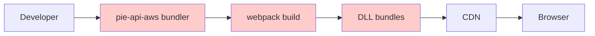
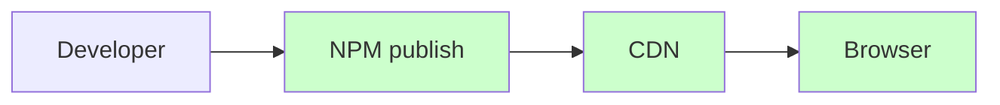
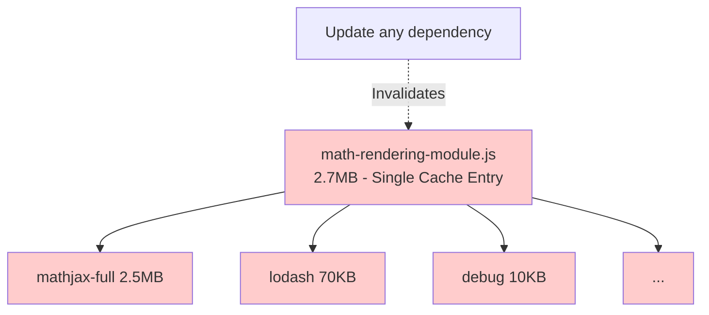
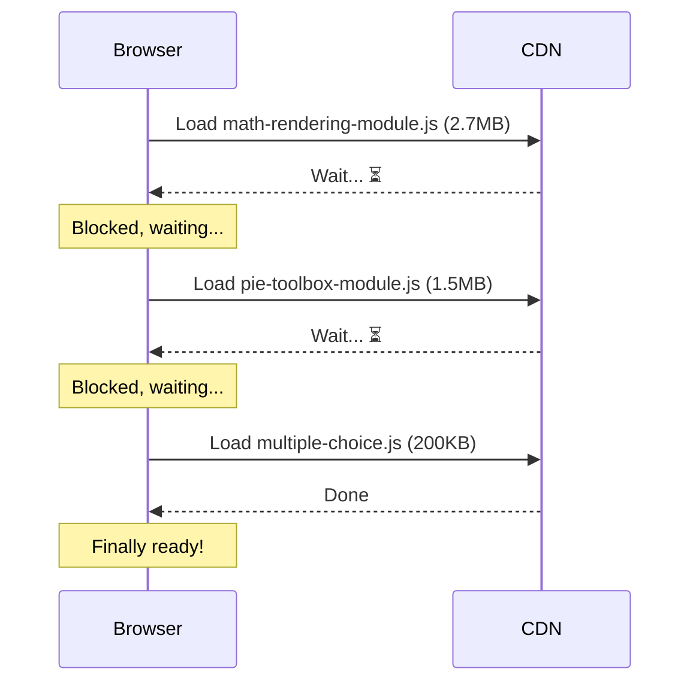
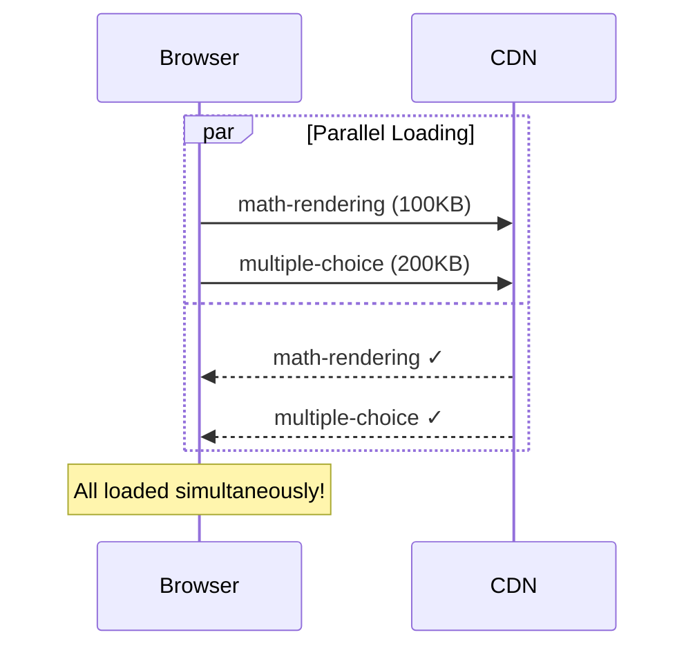
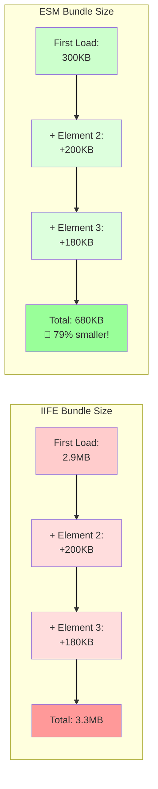

# IIFE Bundle Architecture: How PIE Elements Are Bundled

**Date:** 2026-01-31
**Systems:** pie-shared-lib-builder + pie-api-aws bundler

## Overview

PIE uses a sophisticated **shared library architecture** to minimize bundle duplication. The system has two key components:

1. **pie-shared-lib-builder** (`@pslb/pslb`) - Creates shared library bundles
2. **pie-api-aws bundler** - Creates element IIFE bundles that reference shared libs

## The Problem Being Solved

### Without Shared Libraries (Naive Approach)

```
multiple-choice.js  (~3MB)
├── React (500KB)
├── @mui/material (800KB)
├── @pie-lib/math-rendering (2.7MB)  ← Duplicated!
└── element code (50KB)

drag-in-the-blank.js (~3MB)
├── React (500KB)
├── @mui/material (800KB)
├── @pie-lib/math-rendering (2.7MB)  ← Duplicated!
└── element code (60KB)

Total: ~6MB (with massive duplication)
```

### With Shared Libraries (PIE Approach)

```
Shared Libraries (loaded once):
  @pie-lib/math-rendering-module.js (~2.7MB)
  @pie-lib/pie-toolbox-module.js (~1.5MB)

Element Bundles (reference shared libs):
  multiple-choice.js (~200KB)
  drag-in-the-blank.js (~250KB)

Total: ~4.7MB (21% smaller, and libs cached!)
```

---

## Part 1: Shared Library Builder (@pslb/pslb)

**Location:** `kds/pie-shared-lib-builder`

### Purpose

Creates **shared library bundles** with manifests that describe their contents.

### How It Works

#### Step 1: Build Shared Library

```bash
cd pie-lib/packages/math-rendering
pslb build
```

#### Step 2: Generate manifest.json

```json
{
  "name": "@pie-lib/math-rendering-module",
  "version": "1.0.16",
  "mappings": {
    "@pie-lib/math-rendering": "_dll_pie_lib__math_rendering"
  },
  "versionInfo": {
    "data": {
      "@pie-lib/math-rendering": {
        "version": "2.3.11"
      }
    },
    "hash": "f7881b43b95f70a6c22b3183c73215226c57ac21"
  }
}
```

**Key fields:**

- `mappings`: Package name → internal module name
- `versionInfo`: Tracks what's bundled
- `hash`: Content hash for cache busting

#### Step 3: Create DLL Bundle

The builder uses **Webpack DLL Plugin** to create:

```javascript
// @pie-lib/math-rendering-module/index.js (simplified)
var _dll_pie_lib__math_rendering = (function() {
  // ... full MathJax code here (~2.7MB)
  return {
    renderMath: function(...) { ... },
    wrapMath: function(...) { ... },
    unWrapMath: function(...) { ... },
    mmlToLatex: function(...) { ... }
  };
})();

// Export to global scope
window['_dll_pie_lib__math_rendering'] = _dll_pie_lib__math_rendering;
```

### Publish to NPM

```bash
pslb build --publishLibs --token=<npm-token>
```

This publishes:

- `@pie-lib/math-rendering-module@1.0.16` to NPM
- Contains: `index.js` + `manifest.json`

---

## Part 2: Element Bundle Builder (pie-api-aws)

**Location:** `kds/pie-api-aws/packages/bundler`

### Purpose

Creates **element IIFE bundles** that reference shared libraries instead of bundling them.

### Key Files

```
packages/bundler/src/
├── bundlers/
│   └── player.ts          # Orchestrates bundling
├── webpack/
│   └── player.ts          # Webpack config for IIFE
├── code-generator.ts      # Generates entry files
└── dependency.ts          # Resolves dependencies
```

### How It Works

#### Step 1: Analyze Dependencies

```typescript
// Input: Element dependencies
const deps = [
  { name: '@pie-element/multiple-choice', version: '12.0.0' }
];

// Read package.json
{
  "name": "@pie-element/multiple-choice",
  "dependencies": {
    "@pie-lib/math-rendering": "4.1.0-next.4",  // ← Will be externalized
    "@pie-lib/render-ui": "5.1.0-next.5",
    "react": "18.2.0"
  }
}
```

#### Step 2: Generate Entry Files

**Code:** `bundlers/player.ts:generateJsFile()`

Generates three entry points:

**`player.js`** (student view):

```javascript
// Generated by code-generator.ts
import MultipleChoice from "@pie-element/multiple-choice";

export default {
  "@pie-element/multiple-choice": {
    Element: MultipleChoice,
  },
  "@pie-element/multiple-choice@12.0.0": {
    Element: MultipleChoice,
  },
};
```

**`client-player.js`** (includes controller):

```javascript
import MultipleChoice from "@pie-element/multiple-choice";
import * as Controller from "@pie-element/multiple-choice/controller";

export default {
  "@pie-element/multiple-choice": {
    Element: MultipleChoice,
    controller: Controller,
  },
};
```

**`editor.js`** (includes configure + controller):

```javascript
import MultipleChoice from "@pie-element/multiple-choice";
import Configure from "@pie-element/multiple-choice/configure";
import * as Controller from "@pie-element/multiple-choice/controller";

export default {
  "@pie-element/multiple-choice": {
    Element: MultipleChoice,
    Configure: Configure,
    controller: Controller,
  },
};
```

#### Step 3: Configure Webpack

**Code:** `webpack/player.ts`

**Key configuration:**

```typescript
const BUNDLE_LIB_PACKAGES = ["@pie-lib/pie-toolbox", "@pie-lib/math-rendering"];

const config = {
  // Externalize shared libraries
  externals: {
    "@pie-lib/math-rendering": "@pie-lib/math-rendering",
    "@pie-lib/pie-toolbox": "@pie-lib/pie-toolbox",
  },

  // Output as IIFE attached to window
  output: {
    library: "pie",
    libraryTarget: "window",
    filename: "[name].js",
  },

  // Plugin to resolve per-element versions
  plugins: [
    new NormalModuleReplacementPlugin(
      /@pie-lib\/(math-rendering|pie-toolbox)/,
      (resource) => {
        // Replace with element-specific version
        // e.g., '@pie-lib/math-rendering-multiple-choice'
      },
    ),
  ],
};
```

#### Step 4: Build IIFE Bundle

**Webpack process:**

```
Entry: player.js
  ↓
Resolve imports:
  @pie-element/multiple-choice → bundle it
  @pie-lib/math-rendering → EXTERNAL (don't bundle)
  ↓
Generate IIFE:
  var pie = (function() {
    // Element code here
    // References to @pie-lib/math-rendering remain as globals
  })();
  ↓
Output: player.js (~200KB)
```

**Generated bundle structure:**

```javascript
// player.js (simplified)
var pie = (function () {
  "use strict";

  // External reference (not bundled)
  var mathRendering = window["_dll_pie_lib__math_rendering"];

  // Element code
  var MultipleChoice = function (props) {
    // Uses mathRendering.renderMath()
    mathRendering.renderMath(element);
    // ...
  };

  return {
    "@pie-element/multiple-choice": {
      Element: MultipleChoice,
    },
  };
})();

// Attach to window
window.pie = pie;
```

---

## Part 3: Runtime Loading

### Browser Load Sequence

```html
<!-- 1. Load shared libraries first -->
<script src="https://cdn.example.com/@pie-lib/math-rendering-module@1.0.16/index.js"></script>
<script src="https://cdn.example.com/@pie-lib/pie-toolbox-module@2.0.5/index.js"></script>

<!-- 2. Load element bundle -->
<script src="https://cdn.example.com/bundles/multiple-choice@12.0.0/player.js"></script>

<!-- 3. Element can now use shared libs -->
<script>
  // pie.['@pie-element/multiple-choice'].Element is available
  // It references window['_dll_pie_lib__math_rendering']
</script>
```

### How Elements Find Shared Libraries

**In element source:**

```javascript
import { renderMath } from "@pie-lib/math-rendering";
```

**After webpack externalization:**

```javascript
// Runtime: looks for window['_dll_pie_lib__math_rendering']
const mathRendering = window["_dll_pie_lib__math_rendering"];
const { renderMath } = mathRendering;
```

---

## Math Rendering in IIFE Bundles

### Current Approach (MathJax v3 in Shared Library)

**Shared library:**

```
@pie-lib/math-rendering-module@1.0.16
├── index.js (~2.7MB)
│   └── Contains: mathjax-full, lodash, debug, etc.
└── manifest.json
```

**Element bundle:**

```javascript
// multiple-choice player.js
import { renderMath } from "@pie-lib/math-rendering"; // ← External

// Webpack makes this:
const mathRendering = window["_dll_pie_lib__math_rendering"];
mathRendering.renderMath(element);
```

**Bundle sizes:**

- Shared lib: ~2.7MB (loaded once, cached)
- Element: ~200KB (no math-rendering code)
- Total first load: ~2.9MB
- Total subsequent elements: ~200KB each (lib cached!)

### Why Externalization Works

**Without externalization (every element bundles it):**

```
Element 1: 200KB + 2.7MB = 2.9MB
Element 2: 250KB + 2.7MB = 2.95MB
Element 3: 180KB + 2.7MB = 2.88MB
Total: ~8.7MB
```

**With externalization (shared library):**

```
Shared lib: 2.7MB (once)
Element 1: 200KB
Element 2: 250KB
Element 3: 180KB
Total: ~3.3MB (62% smaller!)
```

---

## Per-Element Library Versions

### The Version Resolution Problem

Different elements may depend on different versions:

```
multiple-choice depends on @pie-lib/math-rendering@4.0.0
drag-in-the-blank depends on @pie-lib/math-rendering@4.1.0
```

### Solution: NormalModuleReplacementPlugin

**Code:** `webpack/player.ts:111-141`

```typescript
new NormalModuleReplacementPlugin(
  /@pie-lib\/(math-rendering|pie-toolbox)/,
  (resource) => {
    const element = elements.find((el) => resource.context.includes(el));
    const libPackage = "@pie-lib/math-rendering";

    // Determine which version this element needs
    if (element) {
      // Use element-specific alias
      // e.g., '@pie-lib/math-rendering-multiple-choice'
      replacement = `${libPackage}-${element}`;
    } else {
      // Use default version
      replacement = `${libPackage}-root`;
    }

    // Rewrite the import
    resource.request = resource.request.replace(libPackage, replacement);
  },
);
```

### Webpack Alias Mapping

```typescript
resolve: {
  alias: {
    '@pie-lib/math-rendering-root': '/path/to/math-rendering@4.0.0',
    '@pie-lib/math-rendering-multiple-choice': '/path/to/math-rendering@4.0.0',
    '@pie-lib/math-rendering-drag-in-the-blank': '/path/to/math-rendering@4.1.0'
  }
}
```

Each element gets the correct version bundled as an external reference.

---

## CDN Deployment

### Bundle Structure on CDN

```
https://proxy.pie-api.com/bundles/
├── @pie-lib/
│   ├── math-rendering-module@1.0.16/
│   │   ├── index.js (2.7MB)
│   │   └── manifest.json
│   └── pie-toolbox-module@2.0.5/
│       ├── index.js (1.5MB)
│       └── manifest.json
└── @pie-element/
    ├── multiple-choice@12.0.0/
    │   ├── player.js (200KB)
    │   ├── client-player.js (250KB)
    │   └── editor.js (300KB)
    └── drag-in-the-blank@11.5.0/
        ├── player.js (220KB)
        └── ...
```

### Load Pattern

```javascript
// PIE Player loads:
1. Analyze item config
2. Determine required elements
3. Load shared libraries (if not cached)
4. Load element bundles
5. Instantiate elements
```

---

## Comparison: IIFE vs ESM Modules

| Aspect           | IIFE (Current)          | ESM (pie-elements-ng) |
| ---------------- | ----------------------- | --------------------- |
| **Format**       | Self-contained function | ES modules            |
| **Dependencies** | External via globals    | Import statements     |
| **Shared libs**  | Manual DLL bundles      | Browser cache + CDN   |
| **Loading**      | Sequential scripts      | Parallel imports      |
| **Bundle size**  | Larger (IIFE wrapper)   | Smaller (no wrapper)  |
| **Caching**      | Per-bundle              | Per-module (better)   |
| **Complexity**   | High (custom tooling)   | Low (native)          |

---

## Why pie-elements-ng Is Moving to ESM

```mermaid
graph TB
    subgraph IIFE["IIFE Architecture (2017-2026)"]
        direction TB
        IIFESource[Element Source Code] --> IIFEBundler[pie-api-aws<br/>Bundler Service]
        IIFEBundler --> IIFEWebpack[Webpack + DLL Plugin]
        IIFEWebpack --> IIFEBundle[IIFE Bundle<br/>+ Shared Libs]
        IIFEBundle --> IIFECDN[CDN]
        IIFECDN --> IIFEBrowser[Browser<br/>window.pie]

        style IIFEBundler fill:#ffcccc
        style IIFEWebpack fill:#ffcccc
    end

    subgraph ESM["ESM Architecture (2026+)"]
        direction TB
        ESMSource[Element Source Code] --> ESMNPM[npm publish]
        ESMNPM --> ESMCDN[esm.sh CDN]
        ESMCDN --> ESMBrowser[Browser<br/>import {  }]

        style ESMNPM fill:#ccffcc
        style ESMCDN fill:#ccffcc
        style ESMBrowser fill:#ccffcc
    end
```

### Historical Context

PIE was started in 2017, when ESM (ECMAScript Modules) was not yet widely supported. At that time:

- Native browser ESM support was experimental
- No CDN ESM distribution existed (esm.sh, jspm, skypack didn't exist)
- Build tools like Webpack were essential for module bundling
- IIFE + DLL pattern was state-of-the-art for shared libraries

The IIFE architecture described above was the **correct solution for 2017**. It successfully:

- Avoided library duplication across elements
- Enabled efficient caching of shared libraries
- Worked reliably across all browsers

### Why ESM Now?

In 2026, the landscape has changed dramatically:

**Browser Support:**

- All modern browsers support ESM natively (95%+ global coverage)
- HTTP/2 makes parallel module loading efficient
- Import maps enable dependency resolution without build tools

**CDN Infrastructure:**

- esm.sh, jspm.dev, skypack.dev provide automatic ESM conversion
- NPM packages can be loaded directly as ESM
- Browser caching works at the module level (even better granularity)

**Developer Experience:**

- No build server required (pie-api-aws bundler not needed)
- Faster iteration (no webpack build step)
- Simpler deployment (just publish to NPM)
- Native browser tooling (source maps just work)

### Problems ESM Solves

#### 1. Eliminates Build Infrastructure

**IIFE approach:**



**ESM approach:**



**Benefits:**

- No `pie-api-aws` bundler server to maintain
- No `pie-shared-lib-builder` tooling required
- No webpack configuration complexity
- No manifest.json generation
- Faster releases (just `npm publish`)

#### 2. Better Caching Granularity

**IIFE bundles:**



❌ If any dependency updates, entire 2.7MB invalidated

**ESM modules:**

```mermaid
graph TD
    Pkg[@pie-lib/math-rendering]
    Pkg --> Index[index.js<br/>5KB<br/>✅ Cached]
    Pkg --> Renderer[renderer.js<br/>95KB<br/>✅ Cached]
    Pkg --> Utils[utils.js<br/>10KB<br/>✅ Cached]

    style Index fill:#ccffcc
    style Renderer fill:#ccffcc
    style Utils fill:#ccffcc

    Update[Update renderer.js] -.->|Only invalidates| Renderer
```

✅ Update one file, other files stay cached

**Impact:** Users download only what changed, not entire bundles.

#### 3. Smaller Bundle Sizes

**IIFE wrapper overhead:**

```javascript
var pie = (function() {
  'use strict';

  // Webpack runtime (~10-20KB)
  // Module loader boilerplate

  // Actual element code
  var MultipleChoice = ...;

  return { ... };
})();
```

**ESM (no wrapper):**

```javascript
// Just the code
export default function MultipleChoice() { ... }
```

**Savings:** 10-30KB per element bundle (5-15% reduction).

#### 4. Parallel Loading

**IIFE (sequential):**



**ESM (parallel):**



**Impact:** Faster initial load (HTTP/2 multiplexing).

#### 5. Version Management Simplified

**IIFE approach:**

```typescript
// Complex webpack plugin to handle version conflicts
new NormalModuleReplacementPlugin(
  /@pie-lib\/(math-rendering|pie-toolbox)/,
  (resource) => {
    // Custom logic to resolve per-element versions
    // Webpack aliases for each version
  },
);
```

**ESM approach:**

```javascript
// Browser handles it natively via import maps
{
  "imports": {
    "@pie-lib/math-rendering": "https://esm.sh/@pie-lib/math-rendering@4.1.0"
  }
}
```

**Benefits:**

- No custom webpack plugins
- Standard browser feature
- Easy to override per element if needed

#### 6. Development Experience

**IIFE workflow:**

```bash
# 1. Make changes to element
vim packages/multiple-choice/src/index.ts

# 2. Build element locally
cd packages/multiple-choice && npm run build

# 3. Request bundler to build IIFE
curl -X POST pie-api-aws/bundler/build

# 4. Wait for webpack to run (~30-60s)

# 5. Deploy to CDN

# 6. Test in browser
```

**ESM workflow:**

```bash
# 1. Make changes
vim packages/multiple-choice/src/index.ts

# 2. Publish to NPM
npm publish

# 3. Test immediately
# Browser loads from esm.sh automatically
```

**Time savings:** Minutes per iteration → seconds per iteration.

### Challenges with ESM

#### 1. Browser Compatibility

**Issue:** Older browsers (IE11, pre-2020 Chrome/Safari) don't support ESM.

**Solution:**

- Modern browsers only (95%+ coverage in 2026)
- Provide IIFE fallback if needed (can still generate)
- Most educational platforms require modern browsers anyway

#### 2. Import Maps Support

**Issue:** Import maps not universally supported until ~2023.

**Solution:**

- Polyfill available: `es-module-shims`
- Native support now at 90%+ coverage
- Can inline imports if import maps unavailable

#### 3. Bare Imports Not Supported

**Issue:** Browsers don't resolve `import 'react'` (bare specifiers).

**Solution:**

- Use full URLs: `import 'https://esm.sh/react@18'`
- Or use import maps to resolve bare specifiers
- Build step can rewrite imports if needed

#### 4. No Tree-Shaking by Default

**Issue:** Browser loads entire module even if only using one export.

**Solution:**

- Author packages with explicit exports
- Use subpath exports: `@pkg/foo/bar` instead of `@pkg` with deep imports
- ESM CDNs (esm.sh) can tree-shake on server

#### 5. HTTP Request Count

**Issue:** Many small modules = many HTTP requests.

**Concern:** "Won't this be slower than bundled IIFE?"

**Reality:**

- HTTP/2 makes parallel requests cheap
- Browser caching means most requests are cache hits
- Granular caching often faster than large bundle re-download
- CDNs optimize module serving

**Mitigation:**

- Bundle "hot path" code together
- Lazy load infrequent features
- Use HTTP/2 server push if needed

#### 6. Debugging Complexity

**Issue:** More modules = harder to debug in browser DevTools.

**Solution:**

- Source maps work natively (simpler than IIFE source maps)
- Browser DevTools improved ESM debugging
- Module boundaries actually make debugging easier (clearer separation)

### Migration Path

pie-elements-ng uses a **hybrid approach** during transition:

1. **Elements are authored as ESM** (source code is ESM-first)
2. **Published as ESM to NPM** (native modules)
3. **Can generate IIFE bundles if needed** (for backwards compatibility)
4. **Math rendering uses MathJax v4** (2.7MB, same as upstream, but CDN-loaded for ESM)

This allows:

- New deployments to use ESM (modern, efficient, CDN-cached MathJax)
- Legacy deployments to use IIFE (if required)
- Full accessibility support (WCAG AAA via Speech Rule Engine)
- Gradual migration without breaking changes

### Real-World Impact



**IIFE bundle (current):**

```text
First load: 2.9MB (2.7MB shared lib + 200KB element)
Second element: +200KB (lib cached)
Third element: +180KB (lib cached)
Total: 3.3MB
```

**ESM bundle (pie-elements-ng with MathJax v4):**

```text
First load: 2.9MB (2.7MB MathJax v4 from CDN + 200KB element)
Second element: +200KB (MathJax cached by browser)
Third element: +180KB (MathJax cached by browser)
Total: 3.3MB (same size, but native browser caching + full accessibility)
```

**Note:** Bundle sizes are comparable to IIFE, but ESM provides:

- **Full accessibility**: WCAG AAA compliance via Speech Rule Engine
- **Native MathML support**: 100% fidelity, no conversion loss
- **No bundler server infrastructure** (~$1000s/mo savings)
- **Faster developer iteration** (minutes → seconds)
- **Simpler deployment pipeline** (npm publish vs bundler + CDN sync)
- **Better browser caching** (per-module vs per-bundle)
- **Native debugging** (no webpack source map complexity)
- **CDN-loaded MathJax** (cached across all PIE deployments globally)

---

## Key Insights for pie-elements-ng

### 1. Math Rendering Must Be External

In IIFE bundles, `@pie-lib/math-rendering` is **NOT** bundled into each element. It's:

- Built as a separate shared library
- Loaded once by the browser
- Referenced by all elements

**This is why the upstream approach works:**

- Elements don't bundle 2.7MB of MathJax each
- Shared library is loaded once and cached
- Elements just reference `window['_dll_pie_lib__math_rendering']`

### 2. ESM Can Do Better

With native ESM:

```javascript
// Element
import { renderMath } from "https://esm.sh/@pie-lib/math-rendering@4.1.0";

// Browser automatically:
// - Caches the module
// - Shares it across elements
// - Parallelizes loading
```

No custom DLL plugin or manifest needed!

### 3. The Wrapper Approach is Correct

For pie-elements-ng:

```typescript
// @pie-lib/math-rendering wraps MathJax v4
export { renderMath, wrapMath, unWrapMath, mmlToLatex } from '@pie-element/shared-math-rendering-mathjax';
```

**Why this works:**

- Elements import from `@pie-lib/math-rendering` (same as upstream)
- Wrapper re-exports from MathJax v4 (full feature parity)
- When elements are bundled as IIFE, wrapper is still external
- Browser only loads one copy (CDN-cached MathJax for ESM, DLL bundle for IIFE)
- Full accessibility support maintained

---

## Summary

### How IIFE Bundles Work

1. **Shared libraries** (like `@pie-lib/math-rendering`) are built as DLL modules
2. **Element bundles** externalize shared libraries
3. **Browser** loads shared libs first, then elements
4. **Elements** reference shared libs via global variables
5. **Result:** Minimal duplication, cached libraries

### Math Rendering in IIFE

- `@pie-lib/math-rendering` is a **2.7MB shared library**
- Elements **don't bundle it** - they reference it externally
- Loaded **once per page** and cached
- All elements share the same instance

### Implications for pie-elements-ng

- The **wrapper approach is validated** - upstream also externalizes math-rendering
- Elements don't bundle it either way (IIFE external or ESM import)
- The 2.7MB cost is **paid once** regardless of approach (MathJax v4 in both cases)
- **ESM loads MathJax from CDN** - cached globally across all PIE deployments
- **Full accessibility maintained** - WCAG AAA compliance via Speech Rule Engine

The key difference: IIFE uses manual DLL tooling, ESM uses native browser module caching + CDN. Both avoid duplication, but ESM is simpler and provides better global caching (jsdelivr CDN vs per-deployment CDN).
