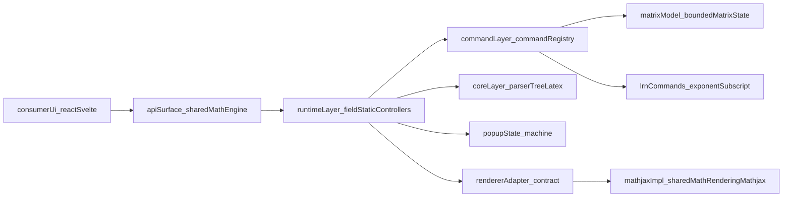
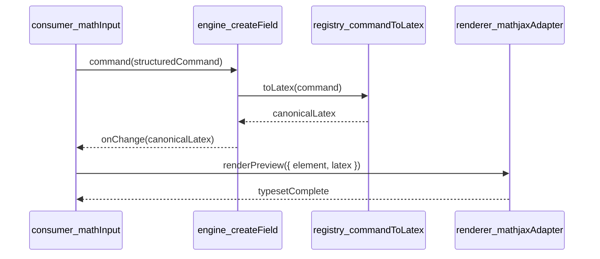
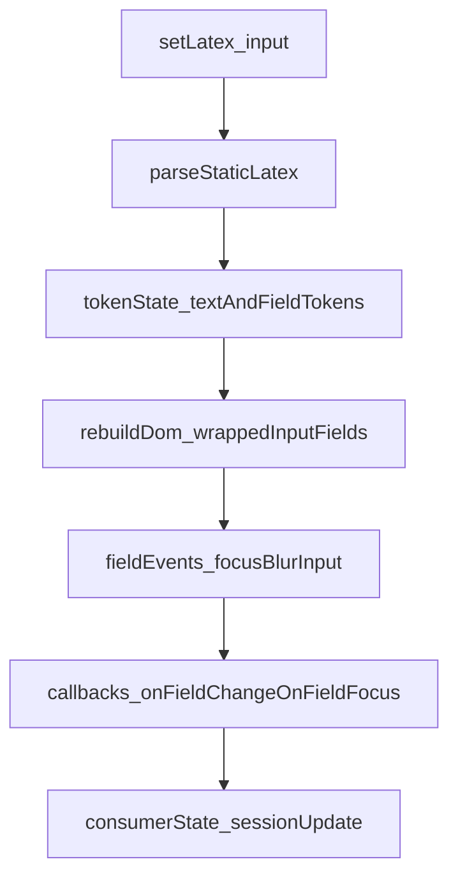

# Math Engine API Contract

## Package

- `@pie-element/shared-math-engine`
- Path: `packages/shared/math-engine`

## Goals

- ESM-native editor/runtime contract without `MathQuill.getInterface(...)`.
- Framework-independent core (`field`, `static`, parser/tree/latex helpers).
- Explicit popup keypad state machine (`closed/opening/open/focus-trap/closing`).
- Renderer adapter contract with a MathJax implementation for static/preview rendering.

## Architecture Overview

`@pie-element/shared-math-engine` is split into four layers:

- **Core:** parser/tree/latex normalization and structural models.
- **Command layer:** explicit command registry for PIE commands (matrix/LRN/symbols).
- **Runtime layer:** field/static controllers with deterministic state updates.
- **Rendering layer:** adapter contract with MathJax implementation.



## Data And Control Flow

The data flow is intentionally unidirectional:

1. Consumer calls controller API (`write`, `command`, `keystroke`, `setLatex`).
2. Runtime converts commands into canonical latex through the command registry.
3. Runtime updates internal state and emits stable callbacks (`onChange`, optional `onReflow`, `onScrollGuard`).
4. For static/preview rendering, renderer adapter performs typesetting.



## Command Pipeline

`MathCommandRegistry` provides explicit structured-command support without MathQuill internals:

- `matrix` with types: `pmatrix`, `bmatrix`, `vmatrix`, `Bmatrix`, `Vmatrix`
- `lrnexponent`, `lrnsquaredexponent`, `lrnsubscript`
- low-risk symbols: `nless`, `ngtr`

Matrix behavior uses `MatrixModel` with:

- max dimensions 5x5
- row insert (`Shift-Enter` intent)
- column insert (`Shift-Space` intent)
- cleanup of empty rows/columns after deletion

## Public API

```ts
createField(initialLatex?, handlers?)
createStatic(initialLatex?, handlers?)
createMathJaxRendererAdapter(options?)
commandToLatex(command)
isEmptyMathValue(latex)
nextPopupState(state, event)
```

### `createField`

Returns an imperative controller:

- `mount(element)`
- `destroy()`
- `setLatex(value)` / `getLatex()`
- `write(value)` / `command(value)` / `keystroke(value)`
- `focus()` / `blur()` / `clear()`
- `selection()`
- optional stability hooks in handlers: `onReflow`, `onScrollGuard`

### `createStatic`

Returns a static+embedded-fields controller:

- `mount(element)`
- `destroy()`
- `setLatex(value)` / `getLatex()`
- `getFields()`
- `getFieldById(id)`

Static parsing supports:

- `\MathQuillMathField[rN]{...}` placeholders
- `\embed{answerBlock}[rN]` normalized to placeholder fields

## Runtime Interaction Diagram

`createStatic` keeps placeholder fields and event dispatch explicit:



### PIE Command Parity

`shared-math-engine` contains an explicit command registry and matrix model:

- `MatrixModel` (bounded to 5x5 with row/column insertion + cleanup)
- LRN commands:
  - `lrnexponent`
  - `lrnsquaredexponent`
  - `lrnsubscript`
- low-risk symbol parity:
  - `\nless`
  - `\ngtr`

These are serialized through `commandToLatex()` and do not rely on MathQuill internals.

### Renderer Adapter

- `renderStatic({ element, latex })`
- `renderPreview({ element, latex })`
- `clear(element)`
- `supportsFeature(feature)`

The first adapter is `createMathJaxRendererAdapter`, backed by
`@pie-element/shared-math-rendering-mathjax`.

## Risk-Gated Learnosity/Khan Decisions

- Included as low-risk value:
  - `\nless` and `\ngtr` symbols
  - `empty()` parity as API helper: `isEmptyMathValue()`
- Skipped as no-op for modern architecture:
  - jQuery-specific runtime patches
  - Khan mobile/i18n hooks that were tied to MathQuill internals

## Testing Layout

Tests for this package live in a dedicated test tree:

- `packages/shared/math-engine/test/**`

No tests should be added under `src/`.

## Migration Notes

- `@pie-lib/math-input` now depends on `@pie-element/shared-math-engine` for `mq.Input` and `mq.Static`.
- Delivery paths in `math-inline` and `math-templated` no longer require direct MathQuill runtime calls.
- Legacy MathQuill package has been removed; upstream transforms now rewrite old imports to `@pie-element/shared-math-engine`.

## Keypad Architecture (UX/A11y Refresh)

The math keypad surface in `@pie-lib/math-input` now uses a generic key-definition contract and deterministic rendering pipeline:

- `keypad/model.ts` defines lane + visual semantics (`numbers`, `operators`, `templates`).
- `keypad/accessible-keypad.tsx` renders the keypad with:
  - stable lane layout for assessment modes
  - deterministic visuals for **all** LaTeX-based keys (no MathJax path in keycaps)
  - explicit primitives for templates and placeholders (`fraction`, `mixed fraction`, `long division`, `superscript`, `subscript`, `sqrt`, `nth-root`, geometry overlays)
  - deterministic symbol glyph mapping for common operators/constants (`<=`, `>=`, trig/log/greek/geometry)
  - keyboard-first behavior with roving focus and Escape close

```mermaid
flowchart LR
  legacyRows[legacyRows_basePlusModeKeys] --> keyModel[keyModel_buildKeyDefinitions]
  keyModel --> laneSplit[laneSplit_numbersOperatorsTemplates]
  laneSplit --> keypadView[keypadView_accessibleKeypad]
  keypadView --> pressEvent[pressEvent_onPressLegacyShape]
  pressEvent --> consumerInput[consumerInput_mathInlineMathTemplated]
```



### Accessibility Behavior

- Every key is a real `button` with explicit `aria-label`.
- Icon glyphs are marked decorative (`aria-hidden`) so labels are announced consistently.
- Arrow keys move within keypad, Home/End jump, Enter/Space activate, Escape requests close.
- Key focus ring uses PIE focus tokens (no hardcoded focus colors).

### Functional Equivalence Notes

- Existing keypad actions (`write`, `command`, `keystroke`) still emit in the legacy shape consumed by existing elements.
- `math-inline` and `math-templated` delivery tooltips now pass `onRequestClose` to allow Escape-based keypad close parity.
- MathJax remains in the system for content/static rendering, but not for keypad keycap rendering.
