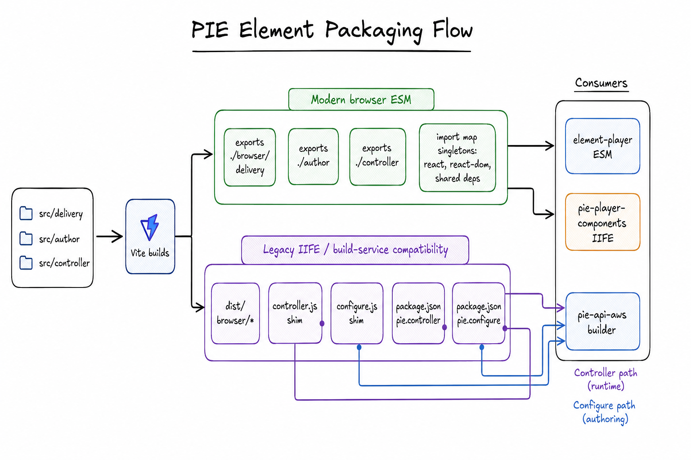

# PIE Element Packaging Architecture

This document explains how this repository packages PIE elements for ESM,
browser ESM, and IIFE consumers. It is an architecture map, not the normative
contract. When this document disagrees with
[`PIE_ELEMENT_CONTRACT.md`](PIE_ELEMENT_CONTRACT.md), the contract wins.
[`PUBLISHING.md`](PUBLISHING.md) describes release process and the checks that
enforce the contract.



## Artifact Families

Each element package can produce three related, but intentionally different,
artifact families.

| Family | Typical output | Package surface | Dependency policy | Primary consumers |
| --- | --- | --- | --- | --- |
| Node and builder ESM | `dist/<view>/index.js` | `.`, `./delivery`, `./author`, `./print`, `./controller` | Most runtime dependencies are externalized for the host bundler | Node tools, package builders, in-repo ESM player mode |
| Browser player ESM | `dist/browser/<view>/index.js` | `./browser/delivery`, `./browser/author`, `./browser/print`, `./browser/controller` | React and React DOM are shared singletons; other UI/runtime leaf dependencies stay bundled | Static browser players such as `pie-players` |
| IIFE | `dist/index.iife.js` or generated `player.js`, `client-player.js`, `editor.js` bundles | Script/global output, not package subpath imports at runtime | Per-element IIFE bundles everything; multi-element bundler externalizes selected shared PIE libs | `@pie-framework/pie-player-components`, legacy players, and demo IIFE strategy |

The in-repo `@pie-element/element-player` ESM path loads the standard package
subpaths such as `@pie-element/multiple-choice/author` and
`@pie-element/multiple-choice/controller`. The `./browser/*` subpaths are the
static-file contract for browser players that load built files directly and
provide their own import map for shared browser singletons.

## Export Surface

Package exports are derived from the source entries that exist under an element
package. During the migration from `../pie-elements`, the temporary upstream sync
scripts write this metadata for synced React packages. The long-term contract is
the package shape described here, not the sync scripts themselves.

Standard ESM exports point at generated `dist` files:

```json
{
  ".": { "types": "./dist/index.d.ts", "default": "./dist/index.js" },
  "./delivery": { "types": "./dist/delivery/index.d.ts", "default": "./dist/delivery/index.js" },
  "./author": { "types": "./dist/author/index.d.ts", "default": "./dist/author/index.js" },
  "./configure": { "types": "./dist/author/index.d.ts", "default": "./dist/author/index.js" },
  "./print": { "types": "./dist/print/index.d.ts", "default": "./dist/print/index.js" },
  "./controller": {
    "types": "./dist/controller/index.d.ts",
    "default": "./dist/controller/index.js"
  },
  "./controller.js": {
    "types": "./dist/controller/index.d.ts",
    "default": "./dist/controller/index.js"
  }
}
```

Browser ESM exports are added when browser output is enabled:

```json
{
  "./browser/delivery": { "default": "./dist/browser/delivery/index.js" },
  "./browser/author": { "default": "./dist/browser/author/index.js" },
  "./browser/print": { "default": "./dist/browser/print/index.js" },
  "./browser/controller": { "default": "./dist/browser/controller/index.js" }
}
```

Packages that do not publish `./browser/*` must publish `./runtime-support`
metadata that makes unsupported ESM explicit. Packages that do publish browser
ESM also declare exact shared singleton versions in `pie.browserSharedDependencies`.
Those versions are checked against `tools/vite/browser-esm-policy.json`.

## Build Pipeline

The core build pipeline is package-local: each element package builds its
declared ESM, browser ESM, IIFE, and type artifacts from its own package
directory. While React elements are still being migrated from `../pie-elements`,
temporary upstream sync scripts generate the package scripts and Vite configs for
those synced packages. They are a migration bridge, not a permanent architectural
layer. A full browser-plus-IIFE package runs:

```bash
vite build
vite build --config ../../../tools/vite/element-browser.config.ts
vite build --config vite.config.iife.ts
tsc --emitDeclarationOnly
```

The main Vite build emits Node/builder ESM. Generated element `vite.config.ts`
files use multi-entry library mode with `preserveModules: true`, so source
entries such as `src/controller/index.ts` become stable dist entries such as
`dist/controller/index.js`. These builds externalize React, React DOM,
`@pie-lib/*`, `@pie-element/*`, MUI, Emotion, and other host-provided libraries.

The shared browser ESM config in `tools/vite/element-browser.config.ts` runs from
the element package directory. It discovers existing `src/delivery`,
`src/author`, `src/print`, and `src/controller` entries, writes them to
`dist/browser`, and only externalizes bare imports listed in
`tools/vite/browser-esm-policy.json`. It injects the owning package name/version
as build-time constants so browser artifacts can derive deterministic,
version-scoped private child custom element tags.

Browser ESM keeps the same registration boundary as the runtime contract:
players own authored top-level PIE tag registration, while an element package
owns the package-private child custom elements it renders internally. This is
why private child definitions such as EBSR's multiple-choice parts are kept in
the browser artifact instead of being discovered by `pie-players` at runtime.
Whether or not EBSR's "two multiple-choice children" design is the ideal
architecture, it is the behavior that existing IIFE bundles have shipped for a
long time, so browser ESM must support it for compatibility.

### Browser ESM CommonJS Interop

Browser ESM builds are static browser files. They must not depend on a runtime
`require` function, and they must not rely on CDN transforms such as jsDelivr
`+esm` to rewrite package internals at load time. Most legacy CommonJS-era code
is handled by upgrading or replacing dependencies during `upstream:sync`, but a
few browser-reachable packages still publish CJS-shaped internals even when
consumed through an ESM entry.

Rolldown represents those cases with a generated helper that tries to call
`require` if the environment provides it and otherwise throws an error like:

```js
var req = /* @__PURE__ */ ((fallback) =>
  typeof require < "u" ? require : fallback)(function (id) {
  throw Error(
    'Calling `require` for "' +
      id +
      "\" in an environment that doesn't expose the `require` function."
  );
});
```

That helper is not browser-safe. The browser build therefore uses
`tools/vite/browser-cjs-require-interop.ts` as a narrowly scoped output pass. It
finds Rolldown require helpers in generated chunks, follows helper exports across
shared chunks, records the literal module IDs passed to those helpers, and
rewrites the helper assignment to call a generated browser dispatcher:

```js
var req = __pieBrowserCjsRequire;
```

The dispatcher is intentionally small and allow-listed:

- `react`, `react-dom`, and `react-dom/client` are mapped to real ESM imports.
  They remain browser shared singletons owned by the player import map.
- `classnames` is mapped to a tiny inline implementation that handles strings,
  numbers, arrays, and object truthy-key expansion.
- `prop-types` is mapped to no-op validators with CommonJS default-import
  compatibility. Production browser ESM does not need runtime prop validation,
  but transitive React packages may still read `PropTypes.string.isRequired`,
  `PropTypes.shape(...)`, `PropTypes.oneOf(...)`, `checkPropTypes`, or
  `resetWarningCache`.

For example, a dependency chunk that contains:

```js
var PropTypes = req("prop-types");
Icon.propTypes = {
  title: PropTypes.string,
  size: PropTypes.oneOfType([PropTypes.string, PropTypes.number]),
};
```

is rewritten so `req("prop-types")` returns an inline object whose validators are
functions returning `null`, with `.isRequired` pointing back to the same
validator. This preserves module evaluation without shipping the CJS
`prop-types` package or introducing browser `require`.

The shim is a compatibility boundary for browser packaging, not a new dependency
policy. If a generated browser chunk calls the helper with any unsupported
package-shaped target, the plugin fails the build instead of silently shipping a
runtime error. Add a new target only when all of the following are true:

- Upgrading, replacing, or removing the dependency is not currently viable.
- The dependency is browser-reachable and required for an element we need to
  ship.
- The fallback behavior is small, deterministic, and safe for production browser
  ESM.
- Focused tests cover the generated helper shape and the expected interop
  behavior in `tools/cli/tests/sync-vite-config.test.ts`.

Per-element IIFE builds use each package's `vite.config.iife.ts`. The current
migration-generated React configs resolve `@pie-element/shared-*` and
`@pie-lib/*` imports to workspace source and set webpack/Rollup externalization
to false, producing a self-contained `dist/index.iife.js` for that package.

Svelte elements use hand-maintained per-view Vite configs but follow the same
public packaging rule: exported package surfaces point at generated files, not
raw source.

## Controller And Configure Packaging

Controller-bearing packages are available dynamically through the package
subpath:

```ts
import * as controller from '@pie-element/multiple-choice/controller';
```

That subpath is the standard ESM API. For compatibility with legacy
filesystem-alias builders, each controller package also publishes a root
`controller.js` shim:

```js
export * from './dist/controller/index.js';
```

The sync package manager writes that shim when a controller source entry exists,
adds `controller.js` to `files`, sets `pie.controller` to
`@pie-element/<name>/controller`, and exposes both `./controller` and
`./controller.js` at the same `dist/controller/index.js` target.

Author-capable packages keep `./author` as the modern ESM entry. For legacy
production builders, the package also exposes `./configure`, sets
`pie.configure` to `@pie-element/<name>/configure`, and publishes a root
`configure.js` shim:

```js
export { default } from './dist/author/index.js';
export * from './dist/author/index.js';
```

For packages whose only authoring source is `src/author`, the legacy
`./configure` export intentionally points at the same `dist/author/index.js`
artifact. This preserves modern `./author` imports while giving alias-based
builders a filesystem-resolvable configure target.

The IIFE bundler also depends on this package-level controller contract.
`packages/shared/bundler-shared/src/entry-generator.ts` reads each installed
package's `package.json`; if `exports["./controller"]` exists, generated
`client-player` and `editor` entries import
`@pie-element/<name>/controller` and expose it as `controller` in the generated
bundle manifest.

## Dependency Location And Singletons

Dependency handling is different for each runtime surface:

| Layer | Where dependencies come from | Singleton or external policy |
| --- | --- | --- |
| Node/builder ESM | Host package manager and host bundler | Generated Vite configs externalize common runtime libraries and workspace packages |
| Browser player ESM | Static `dist/browser` files plus player import map | Only `allowedBareImports` are external; currently React, JSX runtimes, React DOM, and React DOM client |
| Per-element IIFE | The element's IIFE build output | Everything is bundled into that element's IIFE |
| Multi-element IIFE bundler | Temporary install workspace created by `@pie-element/element-bundler` | `@pie-lib/pie-toolbox` and `@pie-lib/math-rendering` are externalized shared PIE libs |
| Demo dev server | Workspace files and optimized dependencies | Additional ProseMirror aliases pin editor packages to one physical Bun store copy |

The browser singleton contract is intentionally not inferred from
`dependencies` or `peerDependencies`. Those fields describe installation.
Browser runtime sharing is governed by `tools/vite/browser-esm-policy.json`,
the package's `pie.browserSharedDependencies`, and the external player's import
map generation. Adding a new shared browser singleton requires updating this
repository's policy and the player import-map generation together. Dependencies
not in the policy should remain bundled by default.

The React browser singleton contract is React 18. The upstream sync pipeline is
therefore allowed to upgrade or replace React 16/17-era helper dependencies
instead of preserving shim support for browser ESM consumers.

## Runtime Consumption

`packages/element-player` supports three strategies:

- `esm` dynamically imports package subpaths such as
  `@pie-element/<name>`, `@pie-element/<name>/author`,
  `@pie-element/<name>/print`, and `@pie-element/<name>/controller`.
- `iife` loads generated bundles, usually through the demo bundle API or a host
  bundle service. Delivery expects the controller to be present in the
  `client-player` bundle when the package has a controller export.
- `preloaded` assumes the host has already registered the custom element tag.
  It is a runtime strategy, not a separate package format.

`packages/shared/bundler-shared` creates multi-element IIFE bundles by installing
requested packages into a temporary workspace, generating entry files, and
running webpack. The generated `player.js` contains element classes,
`client-player.js` contains element classes plus controllers, and `editor.js`
contains author/configure views plus controllers where available.

### Legacy production player components

The production legacy item and authoring players are in
`@pie-framework/pie-player-components` (`../pie-player-components` in the usual
sibling checkout). They do not consume `./browser/*` exports directly. Instead,
they ask the PIE build service for script bundles and then read constructors from
`window.pie.default`.

The important bundle shapes are:

- `pie-player` requests `player.js` for hosted item delivery. It requires
  `Element` only.
- `pie-player` requests `client-player.js` for client-side item preview and
  evaluation. It requires `Element` and `controller`.
- `pie-author` defaults to `editor.js`. It requires `Element`, `Configure`, and
  `controller`.

The generated bundler entries in this repository preserve those shapes:
`player.js` imports the package root element, `client-player.js` adds
`@pie-element/<name>/controller` when `exports["./controller"]` exists, and
`editor.js` adds `@pie-element/<name>/author` as `Configure` when
`exports["./author"]` exists.

The production `pie-api-aws` bundler at `../../kds/pie-api-aws/packages/bundler`
is older than `packages/shared/bundler-shared` and has a stricter compatibility
requirement. It reads `pkg.pie.controller` and `pkg.pie.configure` from the
installed element package, then generates:

- `player.js` from `pkg.pie.element`,
- `client-player.js` from `pkg.pie.element` plus `pkg.pie.controller`,
- `editor.js` from `pkg.pie.element`, `pkg.pie.controller`, and
  `pkg.pie.configure`.

That means `pie.controller` plus the root `controller.js` shim covers item
delivery and client-side scoring. Authoring through the production `pie-author`
path is covered by `pie.configure`, `exports["./configure"]`, and the root
`configure.js` shim, which all resolve to the same implementation as the modern
`./author` entry for current React element packages.

## Verification Gates

Run the aggregate verifier before publishing packages:

```bash
bun run verify:element-contracts
```

That command orchestrates the contract-relevant checks:

- `scripts/check-publish-surface.mjs` verifies dist-only exports, rejects
  forbidden export conditions such as `development` and `svelte`, checks browser
  ESM policy, verifies packed tarball contents, and enforces runtime-support
  metadata for non-browser-ESM elements.
- `tools/cli/src/commands/verify/controllers.ts` checks `pie.controller`,
  `./controller`, `./controller.js`, the root `controller.js` shim,
  `pie.configure`, `./configure`, the root `configure.js` shim, and built
  controller/configure artifacts.
- `scripts/verify-runtime-support-exports.mjs` checks declared
  `./runtime-support` files are publishable.
- `scripts/check-sourcemap-sources.mjs` checks source maps carry inline source
  content so debugging does not depend on raw source being packed.

Before release, also use the smoke matrix in `.compatibility/report.json` to
exercise representative ESM, IIFE, and preloaded flows.

## Common Pitfalls

- Do not add `development` or `svelte` export conditions to package manifests.
  Local source loading belongs in demo resolver tooling, not published package
  exports.
- Do not expose `src`, `.ts`, `.tsx`, `.svelte`, or `.svelte.ts` files as public
  package entry points.
- Do not rely on jsDelivr `+esm` or other CDN package transforms for element
  package code. Browser ESM is built and published under `dist/browser`.
- Do not treat `dependencies` or `peerDependencies` as the browser singleton
  contract. Use `pie.browserSharedDependencies` and the browser ESM policy.
- Do not remove `controller.js` or `configure.js` from packages that declare the
  corresponding `pie.*` metadata. The subpath exports are the modern API, but
  the root shims preserve legacy alias-based builder compatibility.

## Related Documents

- [`PIE_ELEMENT_CONTRACT.md`](PIE_ELEMENT_CONTRACT.md) defines the normative
  runtime and npm package contract.
- [`PUBLISHING.md`](PUBLISHING.md) explains release routing and publish-time
  verification.
- [`IIFE-BUNDLE-ARCHITECTURE.md`](IIFE-BUNDLE-ARCHITECTURE.md) gives deeper
  background on legacy shared-library IIFE bundling.
- [`DEMO_SYSTEM.md`](DEMO_SYSTEM.md) explains how the demo app loads package
  artifacts during development.
