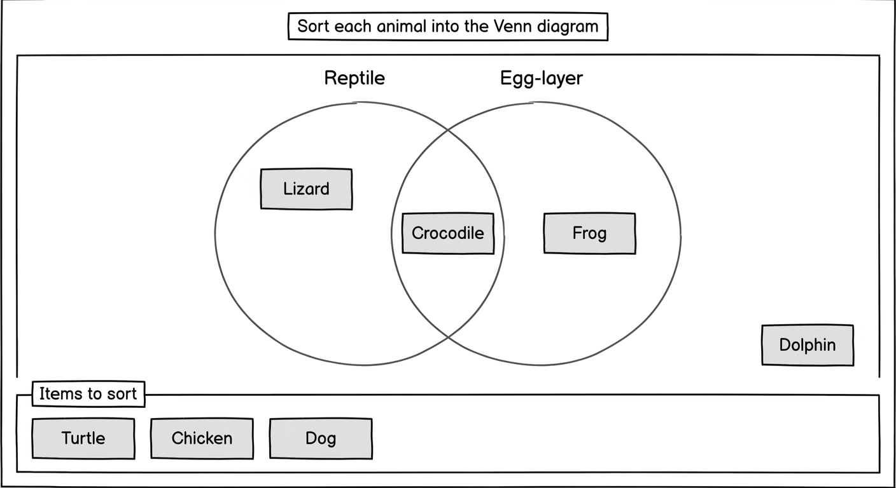

# Venn diagram classification

Status: **Accepted** · Tier: 3 · Impl. path: New

## Context

Classification into overlapping sets is a recurring K-8 pattern across life-science (classify animals that are *reptiles*, *egg-layers*, or both), social studies (attributes of two historical periods), and ELA (character-trait sets that share a region). Most assessment platforms today simulate it using `categorize`, which models **disjoint** buckets and loses the first-class *overlap* region that Venn diagrams depend on. The workaround is visible evidence of demand: authors consistently reach for overlap semantics even when the tooling doesn't support them.

This PRD specifies a new first-class `venn-classification` element with an explicit overlap region, a tile tray, and the same authoring / delivery / scoring surface as other classification-style PIE elements.

Wireframes (2-set; 3-set layout is triangular and will be wireframed alongside delivery implementation):

- Delivery (gather mode): 
- Authoring interface: 

## Goals

- Authors can author a 2-set or 3-set Venn item by choosing a circle count, providing a label per circle, a list of tiles, and the correct region per tile.
- Test-takers can place each tile into exactly one named region of the diagram (4 regions for 2-set, 8 for 3-set, including the outside region) via pointer, touch, or keyboard-only.
- Submitted response has a predictable shape that downstream scoring can read as a per-tile region map, and delivery renders per-tile correctness and a correct-answer reveal in `evaluate` mode.
- Model is N-generic so future delivery work (4+ circles, Euler-style diagrams) doesn't require a breaking data-shape change.
- Element passes WCAG 2.2 AA; every region has a text label beyond its visual position, and placement changes are announced.

## Non-goals

- **Not an extension of `categorize`.** `categorize` assumes disjoint buckets; adding a first-class overlap region would force it to carry a conditional `allowOverlap` mode and a richer `correctRegion` shape even for items that only need one bucket — a penalty paid by every existing `categorize` use. A new sibling element keeps both contracts clean.
- **4+ circles are not rendered in v1.** The data model is N-generic so a future layout can ship without a model migration, but v1 delivery lays out exactly 2 or 3 circles and `validate()` rejects anything else. Moving 4+ layout (region placement, overlap-of-overlaps labelling, tile-size trade-offs) to a later release keeps v1 tight.
- **No author-supplied region shapes** other than circles. No ellipses, no custom SVG masks.
- **A tile cannot belong to multiple regions simultaneously.** Each tile is placed in exactly one region; the overlap regions are their own regions, not multi-assignment.
- **No per-tile scoring weights.** All tiles score equally within an item; scoring policy (all-or-nothing vs. partial credit) is configured once per item.
- **No partial credit for near-miss regions** (e.g. placing a tile in the overlap when the correct region was "left only"). Partial credit operates at per-tile granularity only; within a tile, a wrong region is fully wrong. Region-adjacency heuristics add pedagogical ambiguity (which regions count as "near"?) for little gain.
- **No pre-placed tiles** (tiles that start inside the diagram before the learner begins). Authoring complexity and the a11y cost of "some tiles were already here when you arrived" are not justified in v1.
- **No in-gather hints or progressive reveals per region.** Progressive-hint behaviour is cross-cutting and lives in candidate #20.
- **No rich text, images, or icons in tile labels** for v1. Tile `label` is plain text plus inline math rendered by the host math renderer (MathJax in v1, see Proposed surface). Formatting / inline images / icon-text combinations are deferred until there is concrete demand — they complicate sizing, snap-to-grid layout, and a11y announcement simultaneously.
- **No diagram background image or fill.** Diagrams render on the host's background.
- **No author-editable hex colors.** Circle fills, strokes, and correctness indicators use theme CSS variables (`--pie-primary-*`, `--pie-secondary-*`, `--pie-correct`, `--pie-incorrect`, etc. — see [`docs/THEMING.md`](../../THEMING.md)). Authors don't pick raw colors; changing themes is a host concern.

## Proposed surface

**Model** (key fields; full TS lives in code):

- `prompt` — markup (TipTap output).
- `circles` — ordered array `[{ label: string }, …]`, `length ≥ 2`. v1 delivery renders exactly 2 or 3 circles; the data shape stays N-generic so a v2 layout can ship without a data migration. Indexes are 0-based and stable (the authored order drives which circle is circle 0).
- `regionLabels` — optional `Record<string, string>` keyed by region-key. A region-key is the sorted comma-joined list of circle indexes that define the region: `""` is the outside / "Neither" region, `"0"` is circle 0 only, `"0,1"` is the overlap of circles 0 and 1, `"0,1,2"` is the triple overlap. When a key is missing, delivery auto-composes the label from the circle labels (e.g. `"Reptile only"`, `"Reptile and Egg-layer"`, `"Neither Reptile nor Egg-layer"`). Most authors won't set any entry; overrides are for non-default phrasing like `"Both"` or a translated equivalent.
- `tiles` — `[{ id, label, correctRegion: number[] }, …]`. `label` accepts **plain text with inline math** (rendered by the host math renderer — MathJax in v1 — in delivery, TipTap math extension in authoring). Math matters because a substantial share of real K-8 Venn items are mathematical (classify numbers as *prime* / *odd* / *both*; classify shapes by properties; set-theory items at secondary level). `correctRegion` is a sorted list of circle indexes naming the region the tile belongs in; `[]` means the outside region. For 2 circles the valid values are `[]`, `[0]`, `[1]`, `[0, 1]` (4 regions); for 3 circles any subset of `{0, 1, 2}` (8 regions).
- `scoringPolicy` — `'allOrNothing' | 'partialPerTile'`, default `partialPerTile`. Classification-style items (sort-into-buckets, match, Venn) commonly carry partial-credit-per-placement in K-8 formative assessment — QTI `mapResponse` exists for this pattern — because a single mis-sort shouldn't wipe out a mostly-correct multi-tile response. Items used in high-stakes summative contexts can flip to `allOrNothing`. For a small 2-tile Venn the two policies are equivalent; the distinction starts to matter at 4+ tiles.

**Session** (key fields):

- `placements` — `{ [tileId]: number[] | null }`. `null` means the tile is still in the tray; the key is always present per tile so consumers don't need to diff against `model.tiles` to tell "unplaced" from "never asked". `[]` is the outside region, `[0]` is circle 0 only, `[0, 1]` is the overlap of 0 and 1, etc. Arrays are always sorted.
- `completed` — boolean — true once every tile is placed (no `null` values remain). Host players (e.g. the assessment players Renaissance Star uses) gate learner navigation on this, so it must flip deterministically and atomically on the last placement.

**Modes**: `gather`, `view`, `evaluate`, `configure`. In `evaluate`, delivery is responsible for showing the learner's placements *and* the authored correct regions (per-tile correctness markers plus a "correct answer" reveal affordance); correct-answer rendering is owned by the element, not the player, consistent with other PIE elements.

**Theming**:

Circles render with `pie-venn-circle` and `pie-venn-circle-{n}` class hooks. Fill, stroke, and correctness colors derive from host-theme CSS variables per [`docs/THEMING.md`](../../THEMING.md): circle 0 uses `--pie-primary-*`, circle 1 uses `--pie-secondary-*`, and the 3-set circle 2 uses the theme's tertiary/accent slot (falling back to a derived accent if the theme doesn't define one). Overlap regions use blended / mixed colors computed from the adjacent circle variables at render time. Correctness states in `evaluate` use `--pie-correct` / `--pie-incorrect`. Authors never pick hex colors.

**Key delivery interactions**:

- **Pointer / touch**: drag a tile from the tray (or any region) into a region, or back into the tray. Drop zones highlight on dragover. Tiles snap to a light grid within their region so placements look neat without the learner having to pixel-aim, especially when multiple tiles share a region.
- **Keyboard (two-step)**: `Tab` moves focus through tiles and regions; on a focused tile, `Space` / `Enter` "picks up" the tile (enters placement mode), `Tab` / arrow keys move focus between the tray and each named region, `Space` / `Enter` drops into the focused region, `Esc` cancels the pickup.
- **Atomic drops**: a tile that leaves region A and lands in region B updates `placements[id]` once. No intermediate "held" session state.

**Controller responsibilities**:

- Standard PIE controller surface (`model`, `outcome`, `createDefaultModel`, `validate`, `createCorrectResponseSession`).
- `validate` in v1 requires `circles.length ∈ {2, 3}` and requires each `tile.correctRegion` to be a sorted subset of `[0, circles.length)`; rejects otherwise with a message pointing at the offending tile.
- `outcome` scores based on `scoringPolicy` and returns a fractional score in `[0, 1]` (the PIE outcome convention; a gradebook sees a single number and the UI derives "3 of 4"-style display): `partialPerTile` returns `correctTiles / totalTiles`; `allOrNothing` returns `1` iff every tile matches the authored `correctRegion`, else `0`. Two region arrays are equal iff element-wise equal (they are kept sorted by convention).
- `createCorrectResponseSession` returns placements matching each tile's `correctRegion`.

**Authoring surface**:

- Prompt editor (shared rich-text component).
- Circle-count selector (v1: 2 or 3) and a label input per circle.
- Tile list editor: add / edit / remove / reorder tiles; per-tile correct-region picker — a compact grid whose cells match the regions of the current circle count (4 for 2-set, 8 for 3-set), each labelled with the auto-composed region name.
- Scoring policy selector.
- Optional region-label overrides: any composed region name can be overridden inline; the computed default is shown next to each input while unset so authors aren't surprised by what delivery will render.
- **Live preview panel** mirroring `gather` delivery for the current model and active theme, updating as edits happen. Lets authors confirm overlap sizing, composed labels, and the placement experience without leaving the authoring tool.

## Worked example

> *Prompt*: Sort each animal into the Venn diagram. Place it where **Reptile** and **Egg-layer** are both true, only one is true, or neither is true.

Tiles: `Crocodile`, `Frog`, `Dolphin`, `Turtle`.

The item is authored with `circles = [{ label: "Reptile" }, { label: "Egg-layer" }]`. The learner drops `Crocodile` in the overlap region, `Frog` in "Egg-layer only" (circle 1), `Dolphin` in the outside region, and `Turtle` in the overlap. The submitted `session.placements` is:

```json
{ "crocodile": [0, 1], "frog": [1], "dolphin": [], "turtle": [0, 1] }
```

`session.completed` is `true`. With `scoringPolicy = partialPerTile` and author-marked `correctRegion` values (`crocodile: [0, 1]`, `frog: [1]`, `dolphin: []`, `turtle: [0, 1]`), the outcome is `1.0` (4 of 4 correct).

## Accessibility

- **Keyboard model**: full interaction reachable with `Tab` / `Space` / `Enter` / arrow keys / `Esc`. No pointer-only paths. Picking up a tile announces `"picked up Crocodile, drop target: Reptile only"` and subsequent region focus announces each drop zone by its composed label.
- **Region labels are semantic, not positional.** Accessible names are auto-composed from the circle labels: single-circle region N → `"<circles[N].label> only"`; any multi-circle overlap → the participating labels joined with `" and "` (e.g. `"Reptile and Egg-layer"`, `"A and B and C"`); outside region → `"Neither Reptile nor Egg-layer"` for 2-set, `"None of <a>, <b>, <c>"` for 3-set. An entry in `model.regionLabels` (keyed by the sorted region-key, e.g. `"0,1"` for the overlap or `""` for outside) overrides the auto-composed name verbatim.
- **Screen reader**: polite `aria-live` region announces each placement (`"Crocodile placed in Reptile and Egg-layer"`) and each pickup / cancel. Tile labels containing inline math are announced via Speech Rule Engine output, consistent with other PIE elements that use the host math renderer (MathJax in v1).
- **Hit targets**: tiles meet 44×44 px minimum; drop zones at least 120×120 px so a drop is unambiguous for users with motor constraints.
- **Focus visibility**: 2 px ring on the focused tile or region; the "held" tile during keyboard pickup gets a distinct visual treatment (border + lifted shadow) in addition to the live-region announcement.
- **Reduced motion**: no drag animations; instant state changes only.
- **Color independence**: region correctness in `evaluate` mode is conveyed by icon + text, not color alone.

## Open questions

*(none at this time)*
