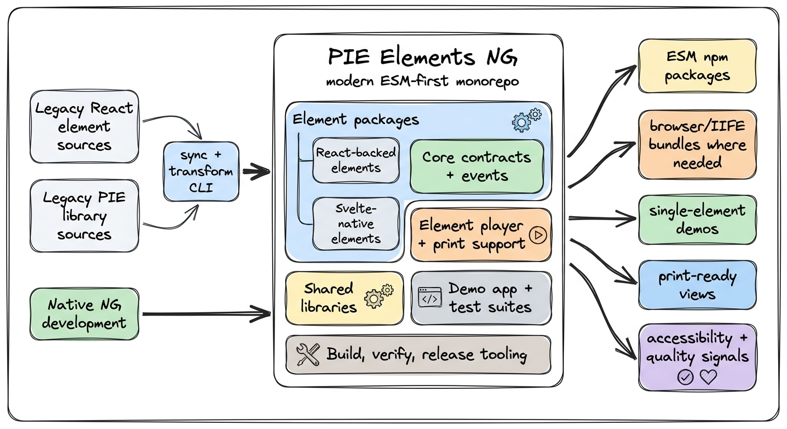

# Why a New Project?

PIE Elements NG is the modern home for PIE element development. It brings assessment element implementations, shared PIE libraries, framework-independent contracts, demo tooling, quality checks, and release automation into one developer experience.

The project exists because the older PIE development model required developers to understand separate element and library projects, legacy module formats, generated demo folders, and custom build conventions before they could make useful changes. PIE Elements NG keeps compatibility with the existing PIE ecosystem while giving new work a cleaner ESM-first foundation.

## What the Project Covers

PIE Elements NG covers the code and workflows needed to build, test, preview, and release PIE question types:

- **Element packages**: student delivery views, authoring views, controllers, and print views for individual assessment interactions.
- **Shared PIE libraries**: reusable rendering, authoring, math, feedback, styling, and utility packages used across elements.
- **Core contracts**: the common model, session, environment, controller, and event shapes that let players and elements communicate consistently.
- **Player and demo tooling**: local surfaces for exercising delivery, authoring, evaluation, and print behavior without creating one demo app per element.
- **Quality and release workflows**: unit tests, browser tests, accessibility checks, IIFE/runtime checks, package verification, Changesets, and CI-driven publishing.

## Architecture at a Glance



## How It Differs From the Legacy Model

| Area | Legacy model | PIE Elements NG model |
| --- | --- | --- |
| Daily development | Developers often had to reason across separate element and library projects. | Most work happens from one monorepo with workspace-linked packages. |
| Module format | CommonJS and bespoke bundling patterns were common. | Packages are ESM-first and built with standard modern tooling. |
| Build tools | Custom scripts and specialized PIE build conventions. | Vite for package builds, Bun for package management, Turbo for workspace orchestration, Biome for formatting/linting. |
| Demos | Per-element generated demo folders. | One shared demo app can load any supported element. |
| Framework direction | Primarily React-oriented. | React-backed packages are maintained through sync, while new NG implementations can be built natively with Svelte or other web-component-friendly approaches. |
| Package shape | Student, authoring, controller, and print concerns were not always peers. | Element packages use a more predictable shape: delivery, authoring, controller, and print are treated as peer surfaces. |

## Package Families

You do not need to memorize the repository layout to understand the project. Conceptually, it has these package families:

- **React-backed elements**: existing production-oriented element implementations brought forward into the modern packaging and tooling model.
- **Svelte-native elements**: new NG element implementations that use Svelte 5 and web components directly.
- **PIE libraries**: shared UI, authoring, math, graphing, feedback, and utility packages that used to be thought of as a separate layer.
- **Shared infrastructure**: event helpers, controller utilities, bundler compatibility, math rendering, feedback behavior, test helpers, and theme support.
- **Core package**: framework-neutral PIE types, events, and common utilities.
- **Apps and players**: internal demo and test applications plus element-level player surfaces for development, documentation, print preview, and advanced embedding.
- **CLI and scripts**: commands for demos, upstream sync, package generation, docs generation, controller verification, dependency checks, and releases.

## Developer Workflow

For normal development, the workflow is intentionally small:

```bash
bun install
bun run build
bun run dev:demo multiple-choice
bun run test
bun run lint
```

The shared demo command starts a single-element development surface where developers can inspect model/session behavior, delivery modes, authoring behavior, print behavior where available, and browser/runtime integration.

## Maintainer Workflow

React-backed elements and React shared libraries are synced from the legacy source of record. That means they should not be edited directly in this project for normal feature work. Maintainers bring those updates in through the project CLI, which analyzes upstream changes, rewrites package structure as needed, verifies compatibility, and commits the transformed result here.

```bash
bun run upstream:status
bun run upstream:update
bun run verify:runtime-support
bun run cli verify:controllers
bun run --cwd apps/element-demo build
```

New NG-native elements, shared infrastructure, demo tooling, accessibility workflows, and release automation are developed directly in this project.

## Players and Print

The project includes an element-level player that is useful for development, testing, documentation, single-element previews, and print-view validation. Production applications usually render complete assessment items through item-level player stacks, because a production item may include passages, multiple elements, markup, rubrics, and application-level orchestration.

Print support follows the same principle: each element owns its print-specific transformations and view, while players decide how to load and orchestrate those views for a given use case.

## Product and Accessibility Work

PIE Elements NG is not only an engineering packaging project. It also gives product, accessibility, QA, and engineering a shared place to coordinate element behavior:

- **Product requirements** describe proposed or accepted behavior changes before implementation when a change affects an element contract or authoring surface.
- **Accessibility planning** tracks WCAG 2.2 AA expectations, automated versus manual validation boundaries, and element-level remediation notes.
- **Jira** owns sprint state, assignments, and delivery tracking.
- **Confluence** is used for stakeholder-friendly summaries and program rollups, not as the canonical source for code contracts.

## Release and Quality Model

Packages are released through Changesets and CI. The release workflow builds the workspace, verifies runtime support, checks controller exports, verifies generated docs, and publishes only the packages selected by the release plan plus packages affected by dependency propagation.

The quality model includes unit tests, browser/e2e tests, accessibility checks, IIFE/runtime compatibility checks, dependency integrity verification, and documentation verification. The goal is to test elements as publishable packages, not only as local source code.

## Current Status

PIE Elements NG is an active modernization project. The current baseline includes a broad set of React-backed PIE elements and shared libraries, new Svelte-native element work, a modern demo app, core package contracts, sync tooling, accessibility planning, and release automation. Existing production consumers can continue using legacy-compatible paths while new development moves toward the NG architecture.

## Quick Reference

| Need | Use |
| --- | --- |
| Install dependencies | `bun install` |
| Build packages | `bun run build` |
| Open an element demo | `bun run dev:demo <element-name>` |
| Run unit tests | `bun run test` |
| Run lint checks | `bun run lint` |
| Check upstream sync status | `bun run upstream:status` |
| Create a package changeset | `bun run changeset:plan -- --packages <package> --type patch --summary "..."` |
