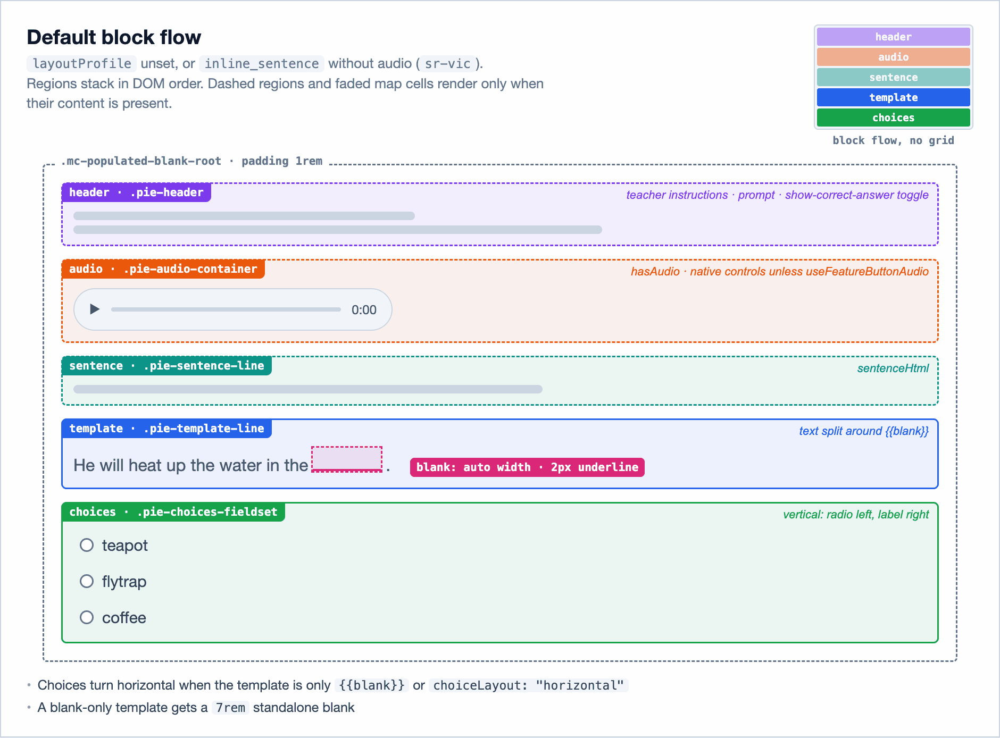
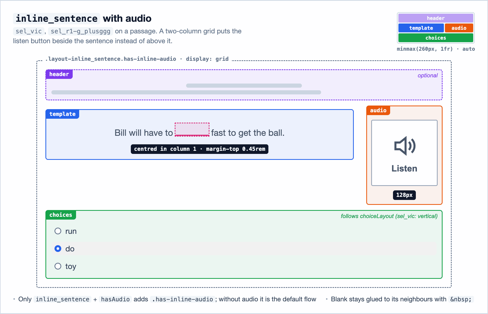
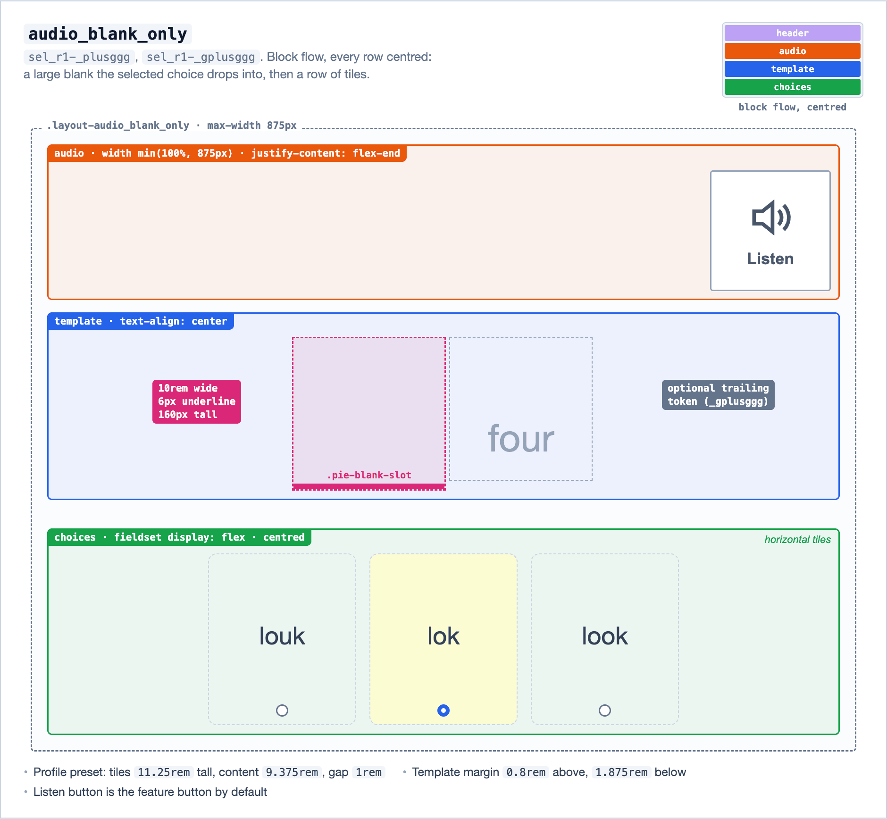
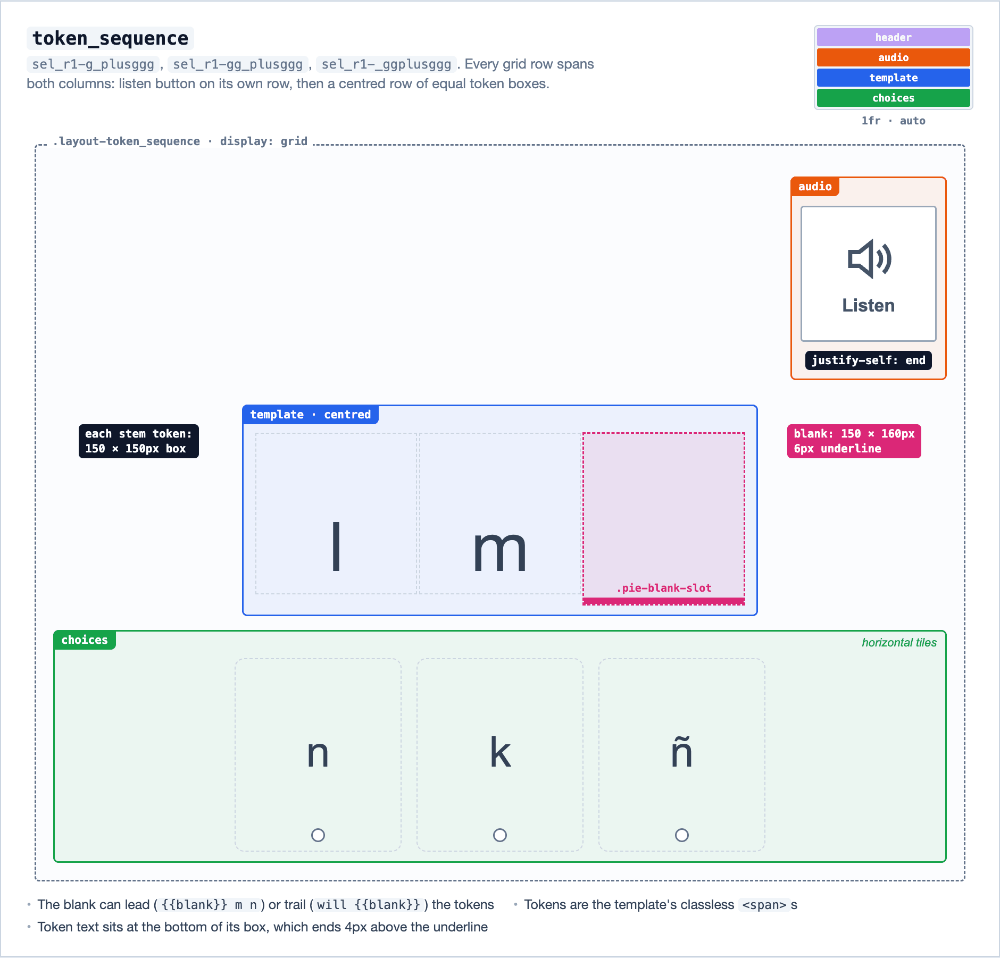
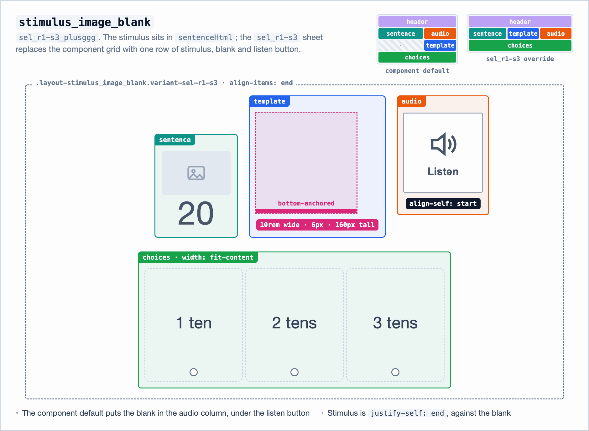
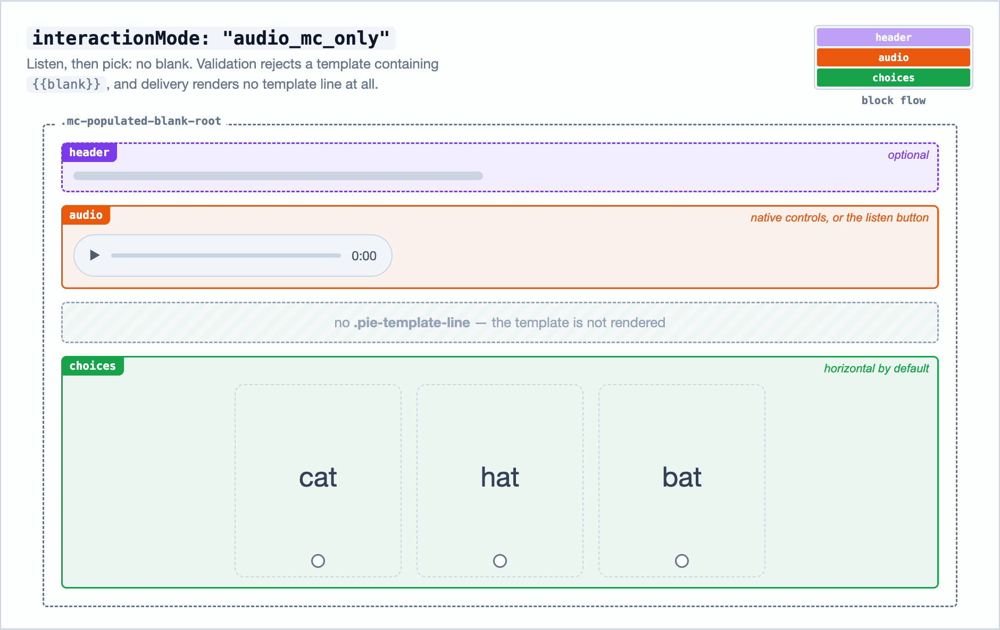
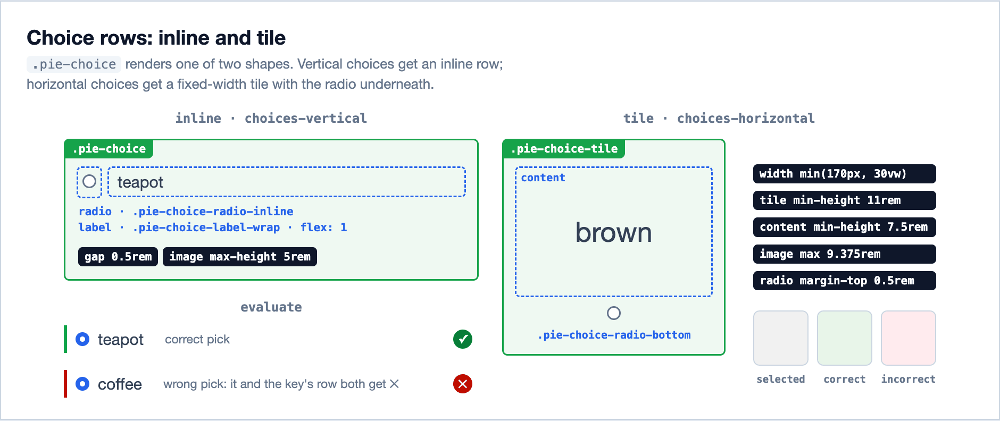
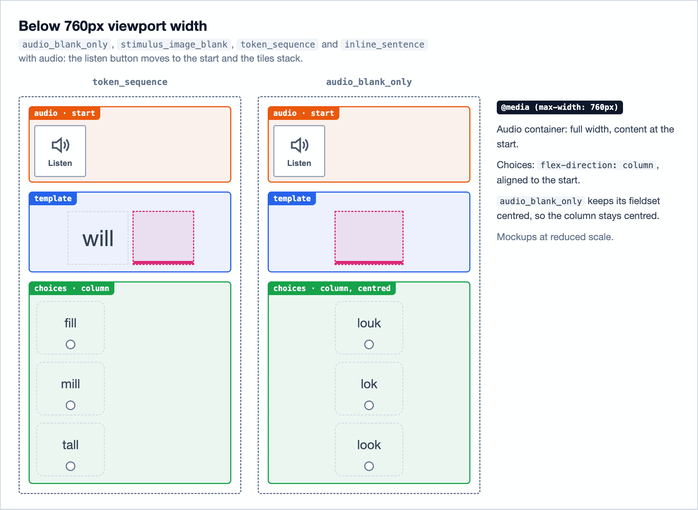

# @pie-element/mc-populated-blank

Svelte 5 PIE element where the learner picks a **multiple-choice** option and that choice **fills a blank** in a sentence/template.

This element is the PIE counterpart for Star CQT "populated blank" interactions. The CQT family had several published `custom_type` flavors, but they are all variants of the same base interaction:

- one selected choice
- one correctness key
- selected choice rendered into a blank target
- optional audio/transcript support

## What the original CQT flavors mean

The historical CQT names mostly describe layout/stimulus differences, not different scoring logic:

- `sel_vic`: sentence-style vocabulary in context, with audio/transcript support
- `sr-vic`: sentence-style vocabulary in context, typically no audio button
- `sel_r1-g_plusggg`: lead token before blank (`before_cloze_1`) plus choice set
- `sel_r1-_gplusggg`: blank with a shorter/token-focused stem arrangement
- `sel_r1-_plusggg`: audio-first blank + choices
- `sel_r1-gg_plusggg`: token-sequence variant with larger glyph-like tokens
- `sel_r1-_ggplusggg`: blank appears before trailing tokens (`after_cloze_*`)
- `sel_r1-s3_plusggg`: stimulus-heavy variant (often image/sentence block + blank + choices)

The shared behavior across these flavors is now represented by one element with configuration, instead of one element per flavor.

## Flavor to model mapping (quick defaults)

Use this as a practical starting point when mapping CQT payloads into `mc-populated-blank` models.

| CQT `custom_type` | Typical layout meaning | Suggested `interactionMode` | Suggested `choiceMode` | Template hint |
| --- | --- | --- | --- | --- |
| `sel_vic` | sentence cloze with audio/transcript | `populate_blank` | `text` | `<p>{before} {{blank}} {after}</p>` |
| `sr-vic` | sentence cloze without listen button | `populate_blank` | `text` | `<p>{before} {{blank}} {after}</p>` |
| `sel_r1-g_plusggg` | lead token before blank | `populate_blank` | `text` | `<p>{before_cloze_1} {{blank}}</p>` |
| `sel_r1-_gplusggg` | short stem + blank | `populate_blank` | `text` | `<p>{before/after segments around {{blank}}}</p>` |
| `sel_r1-_plusggg` | audio-first blank + horizontal choices | `populate_blank` | `text` | `<p>{{blank}}</p>` |
| `sel_r1-gg_plusggg` | token-sequence style before blank | `populate_blank` | `text` | `<p>{before_1}{before_2} {{blank}}</p>` |
| `sel_r1-_ggplusggg` | blank before trailing tokens | `populate_blank` | `text` | `<p>{{blank}} {after_1}{after_2}</p>` |
| `sel_r1-s3_plusggg` | stimulus-heavy/image-first variant | `populate_blank` | `text` or `image` | include stimulus in `prompt`/`sentenceHtml`; keep single blank in `template` |

Notes:

- `choiceMode` should be `image` only when distractors are image choices; otherwise use `text`.
- Current model contract is single-blank for `populate_blank`; dual-cloze source shapes are normalized to one `{{blank}}`.
- `correctChoiceId` should always map from the CQT's `valid_response.name` to canonical `distractor_n`.
- Layout defaults are tuned from original CQT visual baselines, but they are not fixed: override through `model.layoutLimits` when host/theme requirements differ.

## Layouts

`layoutProfile` selects the arrangement and lands on the root as `layout-<layoutProfile>`; the variant sheet for `customType` tunes sizes on top of it (see [Bundled CQT variant CSS](#bundled-cqt-variant-css)). `choiceLayout` sets the choice direction; unset, choices are horizontal when the template is only `{{blank}}` or `interactionMode` is `audio_mc_only`, and vertical otherwise. `audio_blank_only`, `stimulus_image_blank` and `token_sequence` replace the native audio controls with the listen button; `useFeatureButtonAudio` overrides that either way.

| `layoutProfile` | Arrangement | `customType` in the samples |
| --- | --- | --- |
| unset | block flow in DOM order | — |
| `inline_sentence` | block flow; a two-column grid when `hasAudio` | `sr-vic`, `sel_vic` |
| `audio_blank_only` | centred block flow around a large blank | `sel_r1-_plusggg`, `sel_r1-_gplusggg` |
| `token_sequence` | grid: listen row, then a row of token boxes | `sel_r1-g_plusggg`, `sel_r1-gg_plusggg`, `sel_r1-_ggplusggg` |
| `stimulus_image_blank` | grid: stimulus, blank and listen button in one row | `sel_r1-s3_plusggg` |

The figures are wireframes: colour marks a region, a dashed region renders only when its content is present, and a labelled size is what renders without a `layoutLimits` override.

















## Authoring model

- **`prompt`** (optional) and **`promptEnabled`**
- **`template`**: HTML string containing exactly one literal `{{blank}}` token
- **`interactionMode`**: `populate_blank` | `audio_mc_only`
- **`choiceMode`**: `text` | `image`
- **`choices`**: `{ id, labelHtml? }` or `{ id, imageUrl, imageAlt }` per mode
- **`correctChoiceId`**
- **`hasAudio`**, **`audioUrl`**, **`audioTranscript`** (`audioUrl` required when `hasAudio=true`)
- **`autoplayAudioEnabled`**, **`completeAudioEnabled`** (optional integration flags). `completeAudioEnabled` keeps the item incomplete until the audio has played to the end, whether or not autoplay is on.
- **`layoutLimits`** (optional): numeric visual constraints; defaults are based on current CQT parity behavior and can be overridden per item
- **`layoutProfilePresets`** (optional): named preset map by `layoutProfile`; use profile as a template and override with `layoutLimits`
- **`audioButtonSkin`** / **`audioButtonSkinsByLocale`** (optional): override listen-button skin URLs
- **`language`** (optional): the language of the learner-facing strings (`en_US`, `es_ES`, …), which come from `@pie-lib/translator` as in the React elements; `locale` stands in when it is unset
- **`choiceGroupLabel`** (optional): accessibility label used when no visible prompt is present
- **`lockChoiceOrder`** (optional): `false` shuffles the choices, as in multiple-choice, and an instructor sees the order the student saw; `shuffle: true` is the older spelling and counts only when `lockChoiceOrder` is unset
- **`teacherInstructions`** and **`teacherInstructionsEnabled`** (optional): shown to instructors in view and evaluate mode, and in an instructor's printout; unset `teacherInstructionsEnabled` shows them
- **`printAnswerKey`** (optional): `false` leaves the answer key out of an instructor's printout; a student's printout never has it

### `layoutLimits` keys (all optional, positive numbers)

- `blankStandaloneWidthRem`
- `blankWideWidthRem`
- `blankUnderlineWidthPx`
- `blankUnderlineWideWidthPx`
- `horizontalChoiceWidthPx`
- `horizontalChoiceWidthVw`
- `horizontalChoiceTileMinHeightRem`
- `horizontalChoiceContentMinHeightRem`
- `choiceImageMaxHeightRem`
- `choiceImageMaxWidthRem` (shared by the choice tile image and the selected-answer image inside the cloze blank, so they always render at the same size)
- `listenButtonSizePx`
- `stimulusMinColumnPx`
- `textMinColumnPx`
- `legendMaxChars`
- `choiceGroupGapRem`
- `choiceRowGapRem`
- `toggleButtonGapRem`
- `horizontalChoiceRadioTopMarginRem`
- `audioBlankTemplateMarginTopRem`
- `audioBlankTemplateMarginBottomRem`
- `audioInstructionsMaxWidthPx`
- `stimulusGridColumnGapRem`
- `stimulusGridRowGapRem`
- `stimulusSentenceMarginTopRem`
- `stimulusChoicesMarginTopRem`
- `tokenGridColumnGapRem`
- `tokenGridRowGapRem`
- `tokenTemplateMarginTopRem`
- `tokenInlineTokenGapRem`
- `tokenChoicesMarginTopRem`
- `inlineGridColumnGapRem`
- `inlineGridRowGapRem`
- `inlineTemplateMarginTopRem`
- `inlineChoicesMarginTopRem`

## Session

- **`value`**: the selected choice id in a one-entry array, as multiple-choice stores it.
  Sessions written before `value` hold the id as `choiceId`, which the controller and
  delivery still read.

## Implementation hints

- **Controller invariants:** in `populate_blank`, template must contain exactly one `{{blank}}`; in `audio_mc_only`, template must not contain `{{blank}}`.
- **Choice normalization:** choices are polymorphic by `choiceMode` (text via `labelHtml`, image via `imageUrl`/`imageAlt`).
- **Delivery rendering:** template is split around `{{blank}}`; selected choice content is rendered into the blank slot.
- **Layout limits are model-driven:** delivery reads `model.layoutLimits` (blank widths/underline widths, choice tile sizing, image max heights, listen button size, layout column minimums); defaults are CQT-informed but overrideable.
- **Responsive parity control:** `audioInstructionsMaxWidthPx` is configurable to tune desktop vs narrow-width CQT behavior.
- **Evaluate mode behavior:** when evaluate/correct-answer mode is enabled, delivery can render `correctChoiceId` in the blank/choice state.
- **Audio error behavior:** no TTS fallback is used; when `hasAudio=true` and no playable `audioUrl` is provided, delivery shows an explicit error message.
- **Prompt-off accessibility:** when `prompt` is empty, delivery uses `choiceGroupLabel` (or fallback UI text) as the radiogroup accessible name.
- **Print parity:** print renders the delivery component as a player shows the printout's `role` in `view` mode, with the choices in authored order; an instructor's key is the correct-response session, filling the blank and checking the key's choice. Teacher instructions print expanded, and audio prints as its URL and transcript in place of a player.
- **Delivery renders no transcript:** it is an accessibility-catalog alternate, so on `pie-section-player` the assessment toolkit resolves the `transcript` card against the learner's personal needs profile and renders it in a labelled region above this element (PIE-902) — the same path signing takes. `model.audioTranscript` stays on the model for the print view, which has no toolkit, and as the source the pie-api-aws import writes the card from. A host that wants a transcript delivers the toolkit; there is no element-specific CSS class to apply.

## Theming hooks (`pie-*` classes)

Delivery now exposes stable `pie-*` classes so hosts can theme this element with the same class-oriented approach used by other PIE elements.

- Root/container: `pie-element`, `pie-element-mc-populated-blank`, `pie-delivery-root`
- Header, holding teacher instructions, the prompt and the show-correct-answer toggle ahead of the stem: `pie-header`
- Prompt/audio/template: `pie-prompt`, `pie-audio-container`, `pie-audio-player`, `pie-template-line`, `pie-sentence-line`
- Blank display: `pie-blank-slot`, `pie-blank-slot-standalone`, `pie-blank-value`, `pie-blank-image`
- Choice group: `pie-choices-fieldset`, `pie-choices-legend`, `pie-choices`
- Choice rows/items: `pie-choice`, `pie-choice-horizontal`, `pie-choice-selected`, `pie-choice-label`, `pie-choice-image`
- Choice controls: `pie-choice-radio`, `pie-choice-radio-inline`, `pie-choice-radio-bottom`
- Evaluate/toggle feedback: `pie-toggle-correct-answer`, `pie-result-feedback`, `pie-choice-feedback-correct`, `pie-choice-feedback-incorrect`

## Bundled CQT variant CSS

This element bundles variant-specific CSS in delivery, so it loads no stylesheet at runtime:

- Variant CSS files: `src/delivery/cqt-css/*.css`
- Variant mapping: `src/delivery/variant-css-map.ts`
- Applied by `model.customType` (for example `sel_r1-_plusggg`)

Every selector in a variant CSS file starts at `.mc-populated-blank-root` (`variant-css-scope.test.ts` enforces it), so the styles cannot leak into other PIE elements. At injection each root selector is narrowed to roots whose `data-mpb-css` carries a hash of this build's sheets, so two versions of the element on one page style only their own instances. The sheets go into the document head, or into the shadow root the element renders in.

The sheets leave the radio's size to `ChoiceRow.svelte`, which renders it at the 24×24 minimum target size; `variant-css-scope.test.ts` rejects a sheet that scales or resizes `pie-choice-radio`.

### Maintenance workflow

1. Edit the variant's file under `src/delivery/cqt-css/`.
2. If a new `custom_type` is introduced, add it in `src/delivery/variant-css-map.ts` with:
   - `variantId`
   - `variantClass`
   - imported `cssText`
3. Run `bun run build` in this package and validate the demo variants.

## Builds

Same layout as `@pie-element/simple-cloze`: `delivery`, `controller`, `author`, `print`, plus IIFE bundle for script-tag loading.

```bash
bun run build
```

## Demos

- **element-demo:** `apps/element-demo` → `/mc-populated-blank/deliver` (sample configs under `src/lib/samples/mc-populated-blank.json`).
- **pie-players item-demos:** `mc-populated-blank-synthetic-demos.json` (generated from the same models as element-demo).
